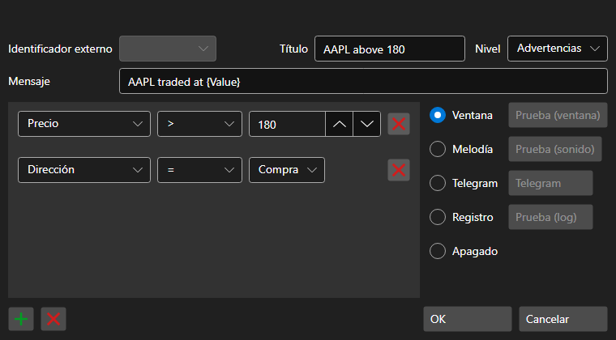

# Ventana de configuración de notificaciones

[AlertSettingsWindow](xref:StockSharp.Alerts.AlertSettingsWindow) - ventana para configurar notificaciones de ciertos eventos

Puede configurar notificaciones sobre cambios en los siguientes tipos de datos: cartera, código de cliente, bróker, depositario, hora del servidor, transacción, tipo de datos, cancelación, ID de orden, ID de orden (cadena), ID de orden (plataforma), derivado, derivado (cadena), precio, volumen (orden), volumen (operación), volumen visible, dirección, saldo, tipo de orden, estado, comentario, mensaje de orden, orden del sistema, hora de expiración de la orden, condición de ejecución, precio, iniciador de la operación, interés abierto, error, condición, tendencia alcista, comisión, retraso, deslizamiento, identificador (usuario), moneda, P\/L, posición, creador de mercado.

Las notificaciones pueden tener la siguiente forma:

- **Ventana** - aparecerá una pequeña ventana emergente con un mensaje en la esquina de la pantalla.
- **Melodía** - se reproducirá la melodía.
- **SMS** - se enviará un mensaje por SMS.
- **Email** - se enviará un mensaje por correo electrónico.
- **Voz** - el mensaje será pronunciado por la voz generada por el equipo.
- **Log** - el mensaje se enviará a la ventana de logs de Designer.
- **Desactivado** - no se mostrará la notificación.
