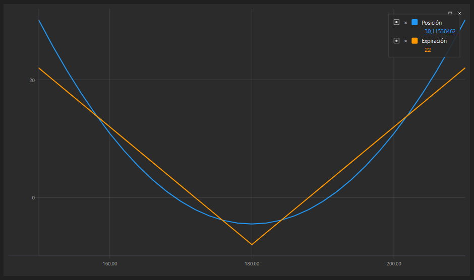

# Gráfico de posición

El componente gráfico [OptionPositionChart](xref:StockSharp.Xaml.Charting.OptionPositionChart) es un gráfico que muestra la posición y las "griegas" de opciones relacionadas con el activo subyacente.

A continuación se muestra el ejemplo SampleOptionQuoting, en el que se usa este gráfico. El código fuente del ejemplo se encuentra en la carpeta *Samples\/06\_Strategies\/09\_LiveOptionsQuoting*.



## Ejemplo SampleOptionQuoting

1. En el código XAML, agregue el elemento [OptionPositionChart](xref:StockSharp.Xaml.Charting.OptionPositionChart) y asígnele el nombre **PosChart**.

   ```xaml
   <Window x:Class="OptionCalculator.MainWindow"
           xmlns="http://schemas.microsoft.com/winfx/2006/xaml/presentation"
           xmlns:x="http://schemas.microsoft.com/winfx/2006/xaml"
           xmlns:loc="clr-namespace:StockSharp.Localization;assembly=StockSharp.Localization"
           xmlns:xaml="http://schemas.stocksharp.com/xaml"
           Title="{x:Static loc:LocalizedStrings.XamlStr396}" Height="400" Width="1030">
       <Grid Margin="5,5,5,5">
       
   	    .........................................................
   	    
   	    <xaml:OptionPositionChart x:Name="PosChart" Grid.Row="7" Grid.Column="0" Grid.ColumnSpan="6" />
   	</Grid>
   </Window>
   				
   ```

2. En el código C#, cree una conexión y suscríbase a los eventos necesarios.

   ```cs
   ...                 
   public readonly Connector Connector = new Connector();
   ...                 
   // suscribirse al evento de conexión correcta
   Connector.Connected += () =>
   {
   	// actualizar etiquetas de la GUI
   	this.GuiAsync(() => ChangeConnectStatus(true));
   };
   // suscribirse al evento de desconexión
   Connector.Disconnected += () =>
   {
   	// actualizar etiquetas de la GUI
   	this.GuiAsync(() => ChangeConnectStatus(false));
   };
   // suscribirse al evento de error de conexión
   Connector.ConnectionError += error => this.GuiAsync(() =>
   {
   	// actualizar etiquetas de la GUI
   	ChangeConnectStatus(false);
   	MessageBox.Show(this, error.ToString(), LocalizedStrings.ErrorConnection);
   });
   // llenar la lista de activos subyacentes
   Connector.SecurityReceived += (sub, security) =>
   {
   	if (security.Type == SecurityTypes.Future)
   		_assets.Add(security);
   };
   Connector.Level1Received += (sub, security) =>
   {
   	if (_model.UnderlyingAsset == security || _model.UnderlyingAsset.Id == security.UnderlyingSecurityId)
   		_isDirty = true;
   };
   // suscribirse a precios tick y actualizar el precio del activo
   Connector.TickTradeReceived += (sub, trade) =>
   {
   	if (_model.UnderlyingAsset == trade.Security || _model.UnderlyingAsset.Id == trade.Security.UnderlyingSecurityId)
   		_isDirty = true;
   };
   Connector.NewPosition += position => this.GuiAsync(() =>
   {
   	var asset = SelectedAsset;
   	if (asset == null)
   		return;
   	var assetPos = position.Security == asset;
   	var newPos = position.Security.UnderlyingSecurityId == asset.Id;
   	if (!assetPos && !newPos)
   		return;
   	RefreshChart();
   });
   Connector.PositionChanged += position => this.GuiAsync(() =>
   {
   	if ((PosChart.AssetPosition != null && PosChart.AssetPosition == position) || PosChart.Positions.Cache.Contains(position))
   		RefreshChart();
   });
   try
   {
   	if (File.Exists(_settingsFile))
   		Connector.Load(new JsonSerializer<SettingsStorage>().Deserialize(_settingsFile));
   }
   ...
   ```

3. Al conectar, establezca la configuración inicial del control:

   1. Restablecer el modelo del control [OptionPositionChart.Model](xref:StockSharp.Xaml.Charting.OptionPositionChart.Model); 
   2. Redibujar el gráfico con los valores iniciales [OptionPositionChart.Refresh](xref:StockSharp.Xaml.Charting.OptionPositionChart.Refresh(System.Nullable{System.Decimal},System.Nullable{System.DateTimeOffset},System.Nullable{System.DateTimeOffset}))**(**assetPrice [System.Nullable\<System.Decimal\>](xref:System.Nullable`1), currentTime [System.Nullable\<System.DateTimeOffset\>](xref:System.Nullable`1), expiryDate [System.Nullable\<System.DateTimeOffset\>](xref:System.Nullable`1) **)**; 
   3. Especificar el proveedor de mensajes para datos de mercado e instrumentos.

   ```cs
   private void ConnectClick(object sender, RoutedEventArgs e)
   {
   	if (!_isConnected)
   	{
   		ConnectBtn.IsEnabled = false;
   ...
   		PosChart.Model = null;
   ...
   		PosChart.MarketDataProvider = Connector;
   		PosChart.SecurityProvider = Connector;
   		PosChart.PositionProvider = Connector;
   		Connector.Connect();
   	}
   	else
   		Connector.Disconnect();
   }
   ```

4. Al recibir instrumentos, agregamos los activos subyacentes a la lista.

   ```cs
   Connector.SecurityReceived += (sub, security) =>
   {
   	if (security.Type == SecurityTypes.Future)
   		_assets.Add(security);
   };
   ```

5. Al cambiar el Level1 del instrumento subyacente o de las opciones, así como al obtener una nueva operación, establecemos la bandera \_isDirty. Esto permite llamar al método RefreshChart (ver más abajo) en el evento del temporizador (el código se omite) para redibujar el gráfico. Así controlamos la frecuencia de redibujo.

   ```cs
   Connector.Level1Received += (sub, security) =>
   {
   	if (_model.UnderlyingAsset == security || _model.UnderlyingAsset.Id == security.UnderlyingSecurityId)
   		_isDirty = true;
   };
   Connector.TickTradeReceived += (sub, trade) =>
   {
   	if (_model.UnderlyingAsset == trade.Security || _model.UnderlyingAsset.Id == trade.Security.UnderlyingSecurityId)
   		_isDirty = true;
   };
   ```

6. En el manejador del evento de aparición de una nueva posición, llamamos a `RefreshChart` para redibujar el gráfico.

   ```cs
   Connector.NewPosition += position => this.GuiAsync(() =>
   {
   	var asset = SelectedAsset;
   	if (asset == null)
   		return;
   	var assetPos = position.Security == asset;
   	var newPos = position.Security.UnderlyingSecurityId == asset.Id;
   	if (!assetPos && !newPos)
   		return;
   	RefreshChart();
   });
   Connector.PositionChanged += position => this.GuiAsync(() =>
   {
   	if ((PosChart.AssetPosition != null && PosChart.AssetPosition == position) || PosChart.Positions.Cache.Contains(position))
   		RefreshChart();
   });
   ```

7. Este método redibuja el gráfico:

   ```cs
   private void RefreshChart()
   {
   	var asset = SelectedAsset;
   	var trade = asset.LastTrade;
   	if (trade != null)
   		PosChart.Refresh(trade.Price);
   }
   ```

## Contenido recomendado

[Trading de volatilidad](../../options/volatility_trading.md)
