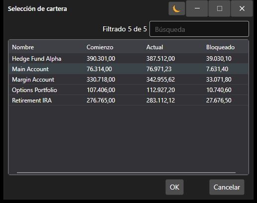

# Ventana de selección de portafolios

[PortfolioPickerWindow](xref:StockSharp.Xaml.PortfolioPickerWindow) es una ventana para seleccionar un portafolio. La ventana muestra una lista de portafolios e información sobre las posiciones de efectivo de los portafolios.



**Propiedades principales**

- [PortfolioPickerWindow.Portfolios](xref:StockSharp.Xaml.PortfolioPickerWindow.Portfolios) - lista de portafolios.
- [PortfolioPickerWindow.SelectedPortfolio](xref:StockSharp.Xaml.PortfolioPickerWindow.SelectedPortfolio) - portafolio seleccionado.

A continuación se muestra el fragmento de código con su uso. 

```cs
private void Button_Click(object sender, RoutedEventArgs e)
{
	var wnd = new PortfolioPickerWindow();
	if (Portfolios != null)
		wnd.Portfolios = Portfolios;
	if (wnd.ShowModal(this))
	{
		SelectedPortfolio = wnd.SelectedPortfolio;
	}
}
	  				
```

