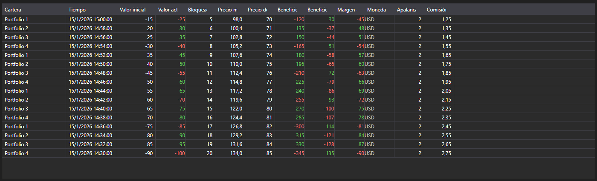

# Cambios de posiciones



[PositionChangeGrid](xref:StockSharp.Xaml.PositionChangeGrid) - una tabla de mensajes [PositionChangeMessage](xref:StockSharp.Messages.PositionChangeMessage). A diferencia de la tabla de carteras no muestra el estado actual sino el flujo de cambios: cada fila es un mensaje con el conjunto de valores modificados.

**Propiedades principales**

- [PositionChangeGrid.Messages](xref:StockSharp.Xaml.PositionChangeGrid.Messages) - lista de mensajes de cambio de posiciones.
- [PositionChangeGrid.SelectedMessage](xref:StockSharp.Xaml.PositionChangeGrid.SelectedMessage) - mensaje seleccionado.
- [PositionChangeGrid.SelectedMessages](xref:StockSharp.Xaml.PositionChangeGrid.SelectedMessages) - mensajes seleccionados.
- [PositionChangeGrid.MaxCount](xref:StockSharp.Xaml.PositionChangeGrid.MaxCount) - número máximo de filas de la tabla; al superarlo se eliminan las filas más antiguas.

Este flujo es útil al analizar discrepancias: se ve qué valor envió el conector y en qué momento, no solo el resultado final.

A continuación se muestran fragmentos de código con su uso:

```xaml
<Window x:Class="Sample.PositionChangesWindow"
	xmlns="http://schemas.microsoft.com/winfx/2006/xaml/presentation"
	xmlns:x="http://schemas.microsoft.com/winfx/2006/xaml"
	xmlns:xaml="http://schemas.stocksharp.com/xaml"
	Height="400" Width="900">
	<xaml:PositionChangeGrid x:Name="PositionChangeGrid" />
</Window>
```

```cs
// Recibimos los cambios de posiciones del conector
_connector.PositionReceived += (subscription, position) =>
{
	var message = position.ToChangeMessage();

	// Añadimos el mensaje a la tabla en el hilo de la interfaz
	this.GuiAsync(() => PositionChangeGrid.Messages.Add(message));
};

// Creamos la suscripción a cambios de posiciones
_connector.Subscribe(new Subscription(DataType.PositionChanges));
```

## Ver también

[Portafolios](../portfolios.md)
