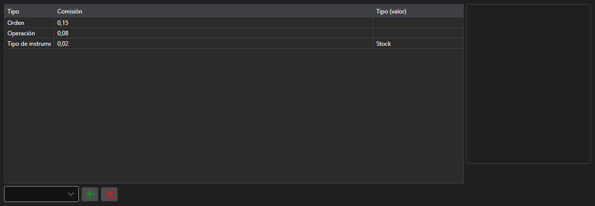

# Reglas de comisión



[CommissionPanel](xref:StockSharp.Xaml.CommissionPanel) - una tabla de reglas de comisión. Cada fila es una regla [ICommissionRule](xref:StockSharp.Algo.Commissions.ICommissionRule): por operación, por volumen, por facturación o un porcentaje del importe.

**Propiedades principales**

- [CommissionPanel.Rules](xref:StockSharp.Xaml.CommissionPanel.Rules) - lista de reglas de comisión.

Las reglas de esta tabla se pasan al gestor de comisiones, de modo que la prueba sobre histórico calcula los costes igual que la operativa real.

A continuación se muestran fragmentos de código con su uso:

```xaml
<Window x:Class="Sample.CommissionWindow"
	xmlns="http://schemas.microsoft.com/winfx/2006/xaml/presentation"
	xmlns:x="http://schemas.microsoft.com/winfx/2006/xaml"
	xmlns:xaml="http://schemas.stocksharp.com/xaml"
	Height="300" Width="700">
	<xaml:CommissionPanel x:Name="CommissionPanel" />
</Window>
```

```cs
// Comisión por operación
CommissionPanel.Rules.Add(new CommissionPerTradeRule { Value = 1.5m });

// Comisión por volumen de la orden
CommissionPanel.Rules.Add(new CommissionPerOrderVolumeRule { Value = 0.01m });

// Aplicamos las reglas al gestor de comisiones
_connector.CommissionManager.Rules.Clear();
_connector.CommissionManager.Rules.AddRange(CommissionPanel.Rules);
```

## Ver también

[Paneles de servicio](../service_panels.md)
