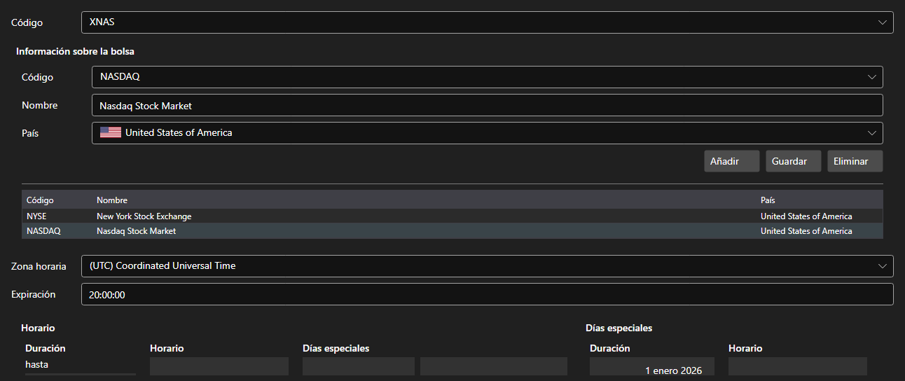

# Plazas



[ExchangeBoardsPanel](xref:StockSharp.Xaml.ExchangeBoardsPanel) - un catálogo de plazas [ExchangeBoard](xref:StockSharp.BusinessEntities.ExchangeBoard). Para cada plaza se definen el código, la bolsa, la zona horaria y el horario de funcionamiento.

**Propiedades principales**

- [ExchangeBoardsPanel.Boards](xref:StockSharp.Xaml.ExchangeBoardsPanel.Boards) - lista de plazas.
- [ExchangeBoardsPanel.SelectedBoardCode](xref:StockSharp.Xaml.ExchangeBoardsPanel.SelectedBoardCode) - código de la plaza seleccionada.

El horario se edita con el [WorkingTimeControl](xref:StockSharp.Xaml.WorkingTimeControl) incorporado. Es ese horario el que indica a la prueba sobre histórico cuándo la plaza está abierta y cuándo cerrada.

A continuación se muestran fragmentos de código con su uso:

```xaml
<Window x:Class="Sample.BoardsWindow"
	xmlns="http://schemas.microsoft.com/winfx/2006/xaml/presentation"
	xmlns:x="http://schemas.microsoft.com/winfx/2006/xaml"
	xmlns:xaml="http://schemas.stocksharp.com/xaml"
	Height="500" Width="800">
	<xaml:ExchangeBoardsPanel x:Name="BoardsPanel" />
</Window>
```

```cs
// Elegimos la plaza
BoardsPanel.SetBoardCode(ExchangeBoard.MicexTqbr.Code);

// Marcamos que el catálogo cambió
BoardsPanel.Changed += () => _isModified = true;

// Guardamos las plazas
foreach (var board in BoardsPanel.Boards)
	_exchangeInfoProvider.Save(board);
```

## Ver también

[Paneles de servicio](../service_panels.md)
