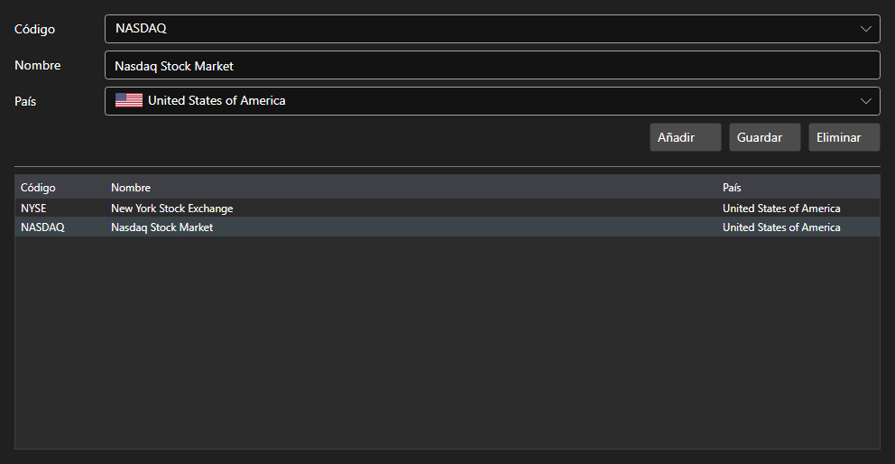

# Bolsas



[ExchangesPanel](xref:StockSharp.Xaml.ExchangesPanel) - un catálogo de bolsas. Muestra la lista de [Exchange](xref:StockSharp.BusinessEntities.Exchange) con el nombre y el país y permite añadir bolsas propias.

**Propiedades principales**

- [ExchangesPanel.Exchanges](xref:StockSharp.Xaml.ExchangesPanel.Exchanges) - lista de bolsas [Exchange](xref:StockSharp.BusinessEntities.Exchange).
- [ExchangesPanel.SelectedExchangeName](xref:StockSharp.Xaml.ExchangesPanel.SelectedExchangeName) - nombre de la bolsa seleccionada.

El panel suele ir junto con [ExchangeBoardsPanel](xref:StockSharp.Xaml.ExchangeBoardsPanel): la bolsa elegida aquí determina qué plazas se muestran allí. El evento `SelectedExchangeChanged` informa del cambio de selección.

A continuación se muestran fragmentos de código con su uso:

```xaml
<Window x:Class="Sample.ExchangesWindow"
	xmlns="http://schemas.microsoft.com/winfx/2006/xaml/presentation"
	xmlns:x="http://schemas.microsoft.com/winfx/2006/xaml"
	xmlns:xaml="http://schemas.stocksharp.com/xaml"
	Height="400" Width="600">
	<xaml:ExchangesPanel x:Name="ExchangesPanel" />
</Window>
```

```cs
// Elegimos la bolsa
ExchangesPanel.SetExchange(Exchange.Moex.Name);

// Reiniciamos la selección de plaza al cambiar de bolsa
ExchangesPanel.SelectedExchangeChanged += () =>
	BoardsPanel.SetBoardCode(null);

// Guardamos el catálogo
foreach (var exchange in ExchangesPanel.Exchanges)
	_exchangeInfoProvider.Save(exchange);
```

## Ver también

[Paneles de servicio](../service_panels.md)
