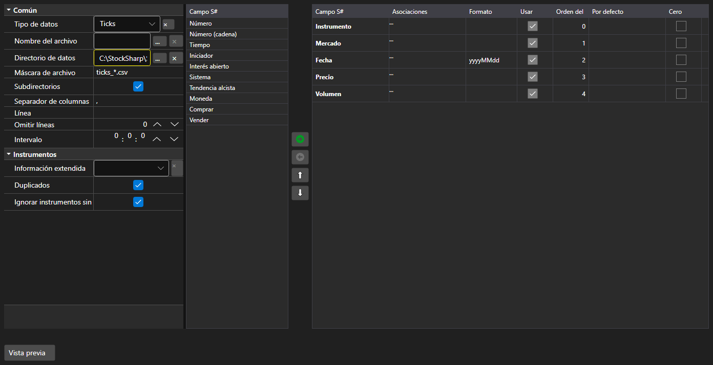

# Ajustes de importación



[ImportSettingsPanel](xref:StockSharp.Xaml.ImportSettingsPanel) - un panel que configura la importación de datos desde un archivo de texto. Define el separador, el formato de fecha y hora, la codificación y, sobre todo, el conjunto y el orden de las columnas.

**Propiedades principales**

- [ImportSettingsPanel.Settings](xref:StockSharp.Xaml.ImportSettingsPanel.Settings) - ajustes de importación.
- [ImportSettingsPanel.SelectedFields](xref:StockSharp.Xaml.ImportSettingsPanel.SelectedFields) - campos seleccionados en el orden en que aparecen en el archivo.
- [ImportSettingsPanel.UnSelectedFields](xref:StockSharp.Xaml.ImportSettingsPanel.UnSelectedFields) - campos que no están en el archivo.

Los campos se trasladan entre las dos listas y se mueven arriba y abajo hasta que su orden coincide con el de las columnas del archivo. El método [ImportSettingsPanel.HasErrors](xref:StockSharp.Xaml.ImportSettingsPanel.HasErrors) valida los ajustes antes de iniciar la importación.

A continuación se muestran fragmentos de código con su uso:

```xaml
<Window x:Class="Sample.ImportWindow"
	xmlns="http://schemas.microsoft.com/winfx/2006/xaml/presentation"
	xmlns:x="http://schemas.microsoft.com/winfx/2006/xaml"
	xmlns:xaml="http://schemas.stocksharp.com/xaml"
	Height="600" Width="900">
	<xaml:ImportSettingsPanel x:Name="ImportPanel" />
</Window>
```

```cs
// Configuramos la importación de ticks
ImportPanel.Settings = new ImportSettings(DataType.Ticks, fields);

// No iniciamos la importación con ajustes erróneos
if (ImportPanel.HasErrors())
	return;

// Creamos el analizador con los campos configurados
var parser = new CsvParser(ImportPanel.Settings.DataType, ImportPanel.SelectedFields);
```

## Ver también

[Paneles de servicio](../service_panels.md)
