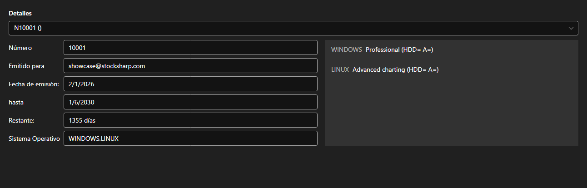

# Licencias



[LicensePanel](xref:StockSharp.Xaml.LicensePanel) - un panel de licencias instaladas. La licencia se elige en la lista superior; debajo están su número, a quién fue emitida, las fechas de emisión y de caducidad, cuántos días quedan y los sistemas operativos admitidos, y a la derecha las funciones que permite.

**Propiedades principales**

- [LicensePanel.Licenses](xref:StockSharp.Xaml.LicensePanel.Licenses) - lista de licencias.

El panel se integra en la ventana «Acerca de» y en el asistente de primer arranque: se ve enseguida qué licencia caduca y qué funciones faltan.

A continuación se muestran fragmentos de código con su uso:

```xaml
<Window x:Class="Sample.LicenseWindow"
	xmlns="http://schemas.microsoft.com/winfx/2006/xaml/presentation"
	xmlns:x="http://schemas.microsoft.com/winfx/2006/xaml"
	xmlns:xaml="http://schemas.stocksharp.com/xaml"
	Height="400" Width="800">
	<xaml:LicensePanel x:Name="LicensePanel" />
</Window>
```

```cs
// Mostramos las licencias instaladas
LicensePanel.Licenses = LicenseHelper.Licenses;
```

## Ver también

[Paneles de servicio](../service_panels.md)
