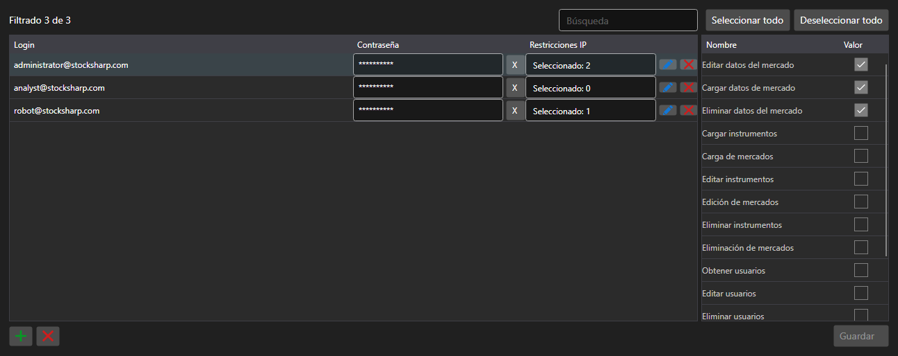

# Cuentas y permisos



[PermissionCredentialsPanel](xref:StockSharp.Xaml.PermissionCredentialsPanel) - una tabla de cuentas del servidor con permisos de acceso. Para cada entrada se marca qué operaciones se permiten: descarga de datos, edición, registro de órdenes, administración del servidor.

**Propiedades principales**

- [PermissionCredentialsPanel.Credentials](xref:StockSharp.Xaml.PermissionCredentialsPanel.Credentials) - lista de cuentas.
- [PermissionCredentialsPanel.ChangedCredentials](xref:StockSharp.Xaml.PermissionCredentialsPanel.ChangedCredentials) - entradas modificadas desde el último guardado.
- [PermissionCredentialsPanel.SaveText](xref:StockSharp.Xaml.PermissionCredentialsPanel.SaveText) - texto del botón de guardado.

El panel no guarda las entradas: con el botón genera el evento `Saving`, la aplicación escribe las cuentas modificadas y llama a [PermissionCredentialsPanel.MarkSaved](xref:StockSharp.Xaml.PermissionCredentialsPanel.MarkSaved), tras lo cual la lista de cambios se vacía.

A continuación se muestran fragmentos de código con su uso:

```xaml
<Window x:Class="Sample.CredentialsWindow"
	xmlns="http://schemas.microsoft.com/winfx/2006/xaml/presentation"
	xmlns:x="http://schemas.microsoft.com/winfx/2006/xaml"
	xmlns:xaml="http://schemas.stocksharp.com/xaml"
	Height="500" Width="900">
	<xaml:PermissionCredentialsPanel x:Name="CredentialsPanel" />
</Window>
```

```cs
// Mostramos las cuentas del servidor
CredentialsPanel.Credentials.AddRange(_server.Credentials);

// Guardamos solo las entradas modificadas
CredentialsPanel.Saving += () =>
{
	foreach (var credentials in CredentialsPanel.ChangedCredentials)
		_server.Save(credentials);

	// Vaciamos la lista de cambios
	CredentialsPanel.MarkSaved();
};
```

## Ver también

[Paneles de servicio](../service_panels.md)
