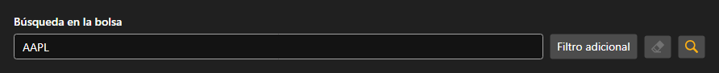

# Búsqueda de instrumentos



[SecurityLookupPanel](xref:StockSharp.Xaml.SecurityLookupPanel) - un panel de búsqueda de instrumentos. En el cuadro se escribe el código o parte de él y, tras el botón de filtro adicional, se abre un editor de [Security](xref:StockSharp.BusinessEntities.Security) donde se indican el tipo, la plaza, la divisa y la fecha de vencimiento.

El panel no busca nada por sí mismo: con el botón de búsqueda o la tecla intro genera el evento `Lookup` con el filtro relleno. Qué hacer después \- enviar la consulta al conector o buscar en el almacenamiento local \- lo decide la aplicación.

A continuación se muestran fragmentos de código con su uso:

```xaml
<Window x:Class="Sample.LookupWindow"
	xmlns="http://schemas.microsoft.com/winfx/2006/xaml/presentation"
	xmlns:x="http://schemas.microsoft.com/winfx/2006/xaml"
	xmlns:xaml="http://schemas.stocksharp.com/xaml"
	Height="500" Width="400">
	<xaml:SecurityLookupPanel x:Name="LookupPanel" />
</Window>
```

```cs
// Enviamos la consulta de búsqueda al conector
LookupPanel.Lookup += filter =>
{
	// El filtro llega ya relleno
	_connector.Subscribe(new Subscription(filter.ToLookupMessage()));
};

// Mostramos los instrumentos encontrados en la tabla
_connector.SecurityReceived += (subscription, security) =>
	this.GuiAsync(() => SecurityGrid.Securities.Add(security));
```

## Ver también

[Paneles de servicio](../service_panels.md)
