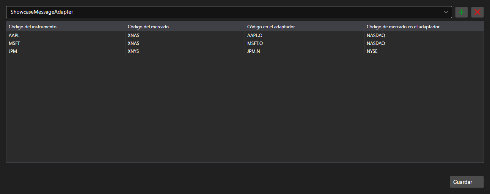

# Correspondencia de códigos de instrumentos



[SecurityMappingPanel](xref:StockSharp.Xaml.SecurityMappingPanel) - una tabla de correspondencias entre el código del instrumento en el sistema y su código en un conector concreto. Resuelve el problema habitual: el mismo contrato se llama de forma distinta en cada proveedor de datos.

**Propiedades principales**

- [SecurityMappingPanel.ConnectorsInfo](xref:StockSharp.Xaml.SecurityMappingPanel.ConnectorsInfo) - lista de conectores para los que se definen las correspondencias.
- [SecurityMappingPanel.Storage](xref:StockSharp.Xaml.SecurityMappingPanel.Storage) - almacenamiento de correspondencias.
- [SecurityMappingPanel.SaveText](xref:StockSharp.Xaml.SecurityMappingPanel.SaveText) - texto del botón de guardado.

Las filas se añaden y se eliminan en la propia tabla, y al pulsar el botón de guardar se genera el evento `Saving`: la aplicación escribe los cambios en el almacenamiento y cambia el texto del botón.

A continuación se muestran fragmentos de código con su uso:

```xaml
<Window x:Class="Sample.MappingWindow"
	xmlns="http://schemas.microsoft.com/winfx/2006/xaml/presentation"
	xmlns:x="http://schemas.microsoft.com/winfx/2006/xaml"
	xmlns:xaml="http://schemas.stocksharp.com/xaml"
	Height="500" Width="900">
	<xaml:SecurityMappingPanel x:Name="MappingPanel" />
</Window>
```

```cs
// Establecemos el almacenamiento de correspondencias
MappingPanel.Storage = _securityMappingStorage;

// Añadimos un conector a la lista
MappingPanel.ConnectorsInfo.Add(new ConnectorInfo("Binance"));

// Confirmamos el guardado con el texto del botón
MappingPanel.Saving += () => MappingPanel.SaveText = LocalizedStrings.Saved;
```

## Ver también

[Paneles de servicio](../service_panels.md)
