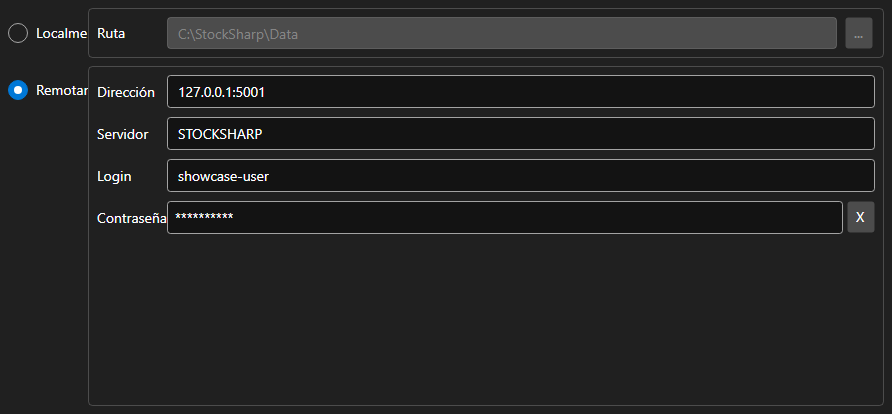

# Ajustes del almacenamiento



[StorageSettingsPanel](xref:StockSharp.Xaml.StorageSettingsPanel) - un panel para elegir el almacenamiento de datos de mercado. Alterna entre una carpeta local y un servidor remoto y define los parámetros de la opción elegida.

**Propiedades principales**

- [StorageSettingsPanel.IsLocal](xref:StockSharp.Xaml.StorageSettingsPanel.IsLocal) - usar el almacenamiento local.
- [StorageSettingsPanel.Path](xref:StockSharp.Xaml.StorageSettingsPanel.Path) - ruta a la carpeta del almacenamiento local.
- [StorageSettingsPanel.Address](xref:StockSharp.Xaml.StorageSettingsPanel.Address) - dirección del servidor remoto.
- [StorageSettingsPanel.Login](xref:StockSharp.Xaml.StorageSettingsPanel.Login) - nombre de usuario para el servidor remoto.
- [StorageSettingsPanel.IsCredentialsEnabled](xref:StockSharp.Xaml.StorageSettingsPanel.IsCredentialsEnabled) - disponibilidad de los campos de usuario y contraseña.

Cualquier cambio genera el evento `SettingsChanged`, con el que la aplicación vuelve a crear el [IMarketDataDrive](xref:StockSharp.Algo.Storages.IMarketDataDrive).

A continuación se muestran fragmentos de código con su uso:

```xaml
<Window x:Class="Sample.StorageWindow"
	xmlns="http://schemas.microsoft.com/winfx/2006/xaml/presentation"
	xmlns:x="http://schemas.microsoft.com/winfx/2006/xaml"
	xmlns:xaml="http://schemas.stocksharp.com/xaml"
	Height="300" Width="500">
	<xaml:StorageSettingsPanel x:Name="StoragePanel" />
</Window>
```

```cs
// Elegimos la carpeta local
StoragePanel.IsLocal = true;
StoragePanel.Path = @"C:\Data";

// Marcamos que los ajustes cambiaron
StoragePanel.SettingsChanged += () => _isModified = true;

// Creamos el almacenamiento según los ajustes del panel
var drive = StoragePanel.IsLocal
	? new LocalMarketDataDrive(StoragePanel.Path)
	: (IMarketDataDrive)new RemoteMarketDataDrive(StoragePanel.Address.To<EndPoint>());
```

## Ver también

[Paneles de servicio](../service_panels.md)
