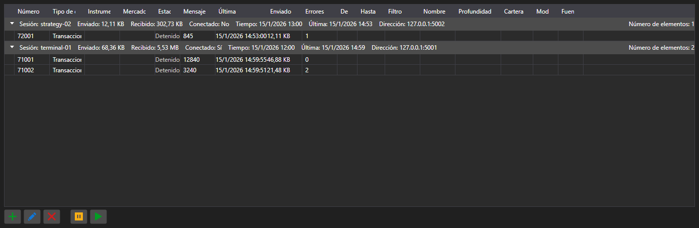

# Suscripciones



[SubscriptionPanel](xref:StockSharp.Xaml.SubscriptionPanel) - una tabla de suscripciones activas agrupada por sesiones. Para cada suscripción muestra el tipo de datos, el número de mensajes, la hora del último mensaje, el número de errores y el volumen de datos transferidos.

**Propiedades principales**

- [SubscriptionPanel.Subscriptions](xref:StockSharp.Xaml.SubscriptionPanel.Subscriptions) - lista de suscripciones.
- [SubscriptionPanel.Sessions](xref:StockSharp.Xaml.SubscriptionPanel.Sessions) - lista de sesiones.
- [SubscriptionPanel.SelectedSubscriptions](xref:StockSharp.Xaml.SubscriptionPanel.SelectedSubscriptions) - suscripciones seleccionadas.

El panel se usa en el lado del servidor: muestra quién está conectado, qué solicita y cuántos datos recibe. Las acciones sobre las filas \- añadir, modificar, eliminar, suspender \- generan los eventos del mismo nombre y las ejecuta la aplicación.

A continuación se muestran fragmentos de código con su uso:

```xaml
<Window x:Class="Sample.SubscriptionsWindow"
	xmlns="http://schemas.microsoft.com/winfx/2006/xaml/presentation"
	xmlns:x="http://schemas.microsoft.com/winfx/2006/xaml"
	xmlns:xaml="http://schemas.stocksharp.com/xaml"
	Height="400" Width="1000">
	<xaml:SubscriptionPanel x:Name="SubscriptionPanel" />
</Window>
```

```cs
// Registramos la sesión del cliente
SubscriptionPanel.AddSession(sessionId, new SessionInfo(sessionId, DateTime.UtcNow, address));

// Añadimos la suscripción a la tabla
SubscriptionPanel.Subscriptions.Add(new SubscriptionInfo(session, subscription));

// Cancelamos la suscripción por orden de la tabla
SubscriptionPanel.SubscriptionRemoving += info => _connector.UnSubscribe(info.Subscription);
```

## Ver también

[Paneles de servicio](../service_panels.md)
