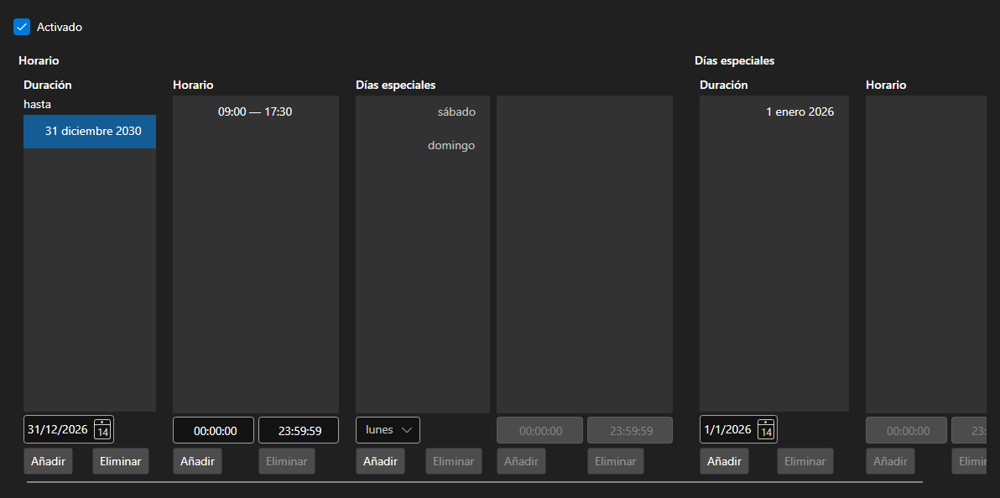

# Horario de funcionamiento



[WorkingTimeControl](xref:StockSharp.Xaml.WorkingTimeControl) - un editor del horario [WorkingTime](xref:StockSharp.Messages.WorkingTime). Define los periodos de vigencia, las horas de funcionamiento por día de la semana y los días especiales \- festivos y traslados.

**Propiedades principales**

- [WorkingTimeControl.WorkingTime](xref:StockSharp.Xaml.WorkingTimeControl.WorkingTime) - horario editado.
- [WorkingTimeControl.ShowActive](xref:StockSharp.Xaml.WorkingTimeControl.ShowActive) - indicación del periodo vigente.

Un horario se compone de periodos, cada uno con su propio conjunto de horas por día de la semana. Las horas se editan como una lista de intervalos y los errores \- intervalos solapados, un fin anterior al inicio \- se informan con el evento `Error`.

A continuación se muestran fragmentos de código con su uso:

```xaml
<Window x:Class="Sample.WorkingTimeWindow"
	xmlns="http://schemas.microsoft.com/winfx/2006/xaml/presentation"
	xmlns:x="http://schemas.microsoft.com/winfx/2006/xaml"
	xmlns:xaml="http://schemas.stocksharp.com/xaml"
	Height="500" Width="700">
	<xaml:WorkingTimeControl x:Name="WorkingTimeControl" />
</Window>
```

```cs
// Mostramos el horario de la plaza
WorkingTimeControl.WorkingTime = ExchangeBoard.MicexTqbr.WorkingTime;

// Mostramos el error junto al editor
WorkingTimeControl.Error += (message, isError) => ShowStatus(message, isError);

// Marcamos que el horario cambió
WorkingTimeControl.DataChanged += () => _isModified = true;
```

## Ver también

[Paneles de servicio](../service_panels.md)
