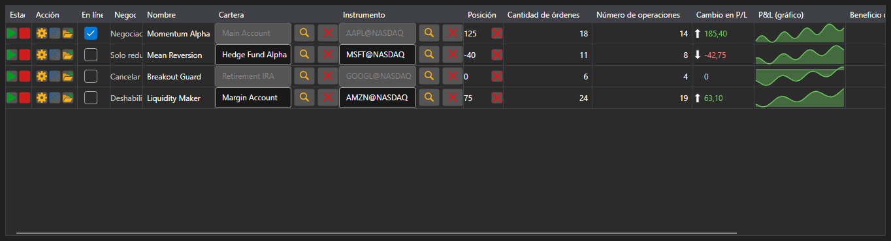

# Monitor de estrategias



[StrategiesDashboard](xref:StockSharp.Xaml.StrategiesDashboard) - una tabla de estrategias en ejecución simultánea. Una fila muestra el instrumento, la cartera, el estado, la posición, el beneficio, el número de órdenes y operaciones y los botones de control.

**Propiedades principales**

- [StrategiesDashboard.Items](xref:StockSharp.Xaml.StrategiesDashboard.Items) - lista de filas del monitor.
- [StrategiesDashboard.SecurityProvider](xref:StockSharp.Xaml.StrategiesDashboard.SecurityProvider) - proveedor de instrumentos para la columna de instrumento.
- [StrategiesDashboard.Portfolios](xref:StockSharp.Xaml.StrategiesDashboard.Portfolios) - fuente de carteras para la columna de cartera.

Una fila del monitor es un [IStrategiesDashboardItem](xref:StockSharp.Xaml.IStrategiesDashboardItem) y no la estrategia en sí: los botones de inicio, parada, cierre de posición, configuración y reglas de riesgo funcionan mediante los comandos de esa interfaz. Por eso el monitor sirve tanto para estrategias locales como para las que se ejecutan en un servidor.

A continuación se muestran fragmentos de código con su uso:

```xaml
<Window x:Class="Sample.DashboardWindow"
	xmlns="http://schemas.microsoft.com/winfx/2006/xaml/presentation"
	xmlns:x="http://schemas.microsoft.com/winfx/2006/xaml"
	xmlns:xaml="http://schemas.stocksharp.com/xaml"
	Height="400" Width="1100">
	<xaml:StrategiesDashboard x:Name="Dashboard" />
</Window>
```

```cs
// Establecemos las fuentes para las columnas de instrumento y cartera
Dashboard.SecurityProvider = _connector;
Dashboard.Portfolios = new PortfolioDataSource(_connector);

// Añadimos filas del monitor para nuestras estrategias
foreach (var strategy in _strategies)
	Dashboard.Items.Add(new StrategyDashboardItem(strategy));

// Quitamos del monitor la estrategia detenida
Dashboard.Items.Remove(Dashboard.Items.First(i => i.ProcessState == ProcessStates.Stopped));
```

## Ver también

[Estrategias](../strategies.md)
