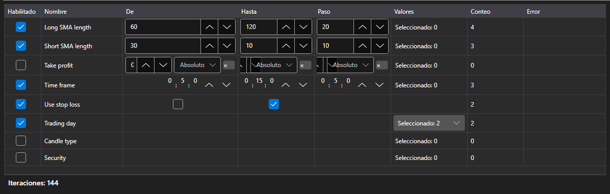

# Parámetros de optimización



[OptimizationParametersPanel](xref:StockSharp.Xaml.OptimizationParametersPanel) \- editor de los parámetros sobre los que se hace la búsqueda por fuerza bruta. Una fila \- un parámetro de la estrategia: la casilla lo incluye en la búsqueda, después vienen los límites y el paso o bien la lista de valores, y debajo de la tabla \- el total: cuántas iteraciones da el conjunto actual.

**Propiedades principales**

- [OptimizationParametersPanel.Parameters](xref:StockSharp.Xaml.OptimizationParametersPanel.Parameters) \- filas del editor. Sirve cualquier colección [IOptimizationParameterRow](xref:StockSharp.Xaml.IOptimizationParameterRow), por lo que cada aplicación puede tener su propio modelo de parámetro.
- [OptimizationParametersPanel.MaxIterations](xref:StockSharp.Xaml.OptimizationParametersPanel.MaxIterations) \- límite del número de iteraciones; cero significa que no hay límite.
- [OptimizationParametersPanel.TotalCount](xref:StockSharp.Xaml.OptimizationParametersPanel.TotalCount) \- cuántas iteraciones da el conjunto actual: el producto del número de valores de todos los parámetros activados, recortado por el límite.
- [OptimizationParametersPanel.FirstProblem](xref:StockSharp.Xaml.OptimizationParametersPanel.FirstProblem) \- la primera razón por la que el conjunto no se puede ejecutar.

El conjunto de valores depende del tipo de parámetro: para un número y para [TimeSpan](xref:System.TimeSpan) son los límites y el paso; para [bool](xref:System.Boolean) \- dos valores; para una enumeración, [Security](xref:StockSharp.BusinessEntities.Security) y [DataType](xref:StockSharp.Messages.DataType) \- una lista explícita. La fila que no se puede recorrer (el paso es cero, los límites no están definidos, la lista está vacía) explica el motivo en la propia tabla, y el contador del total no la tiene en cuenta.

El número de iteraciones crece como un producto y no como una suma: tres parámetros de cinco valores cada uno \- son 125 iteraciones y no 15. Por eso el contador está junto a la tabla y no en el paso siguiente del asistente.

A continuación se muestran fragmentos de código con su uso:

```xaml
<Window x:Class="Sample.OptimizationWindow"
	xmlns="http://schemas.microsoft.com/winfx/2006/xaml/presentation"
	xmlns:x="http://schemas.microsoft.com/winfx/2006/xaml"
	xmlns:xaml="http://schemas.stocksharp.com/xaml"
	Height="400" Width="700">
	<xaml:OptimizationParametersPanel x:Name="ParametersPanel" />
</Window>
```

```cs
// Las filas del editor son el modelo de la aplicación que implementa IOptimizationParameterRow
ParametersPanel.Parameters = _rows;

// Límite del número de iteraciones
ParametersPanel.MaxIterations = 5000;

// Se puede iniciar cuando el conjunto no está vacío y no contiene errores
StartButton.IsEnabled = ParametersPanel.TotalCount > 0 && ParametersPanel.FirstProblem.Length == 0;
```

## Ver también

[Estrategias](../strategies.md)

[Resultados de optimización](optimization_results.md)
