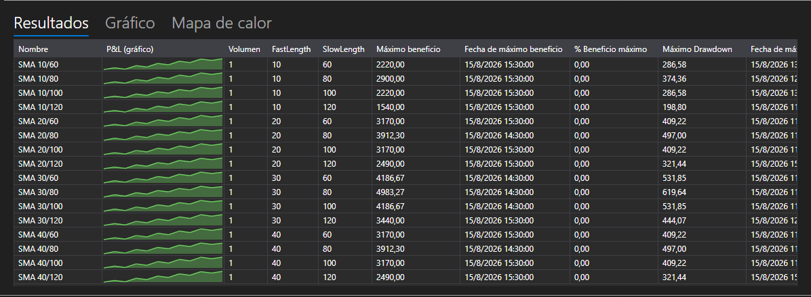

# Resultados de optimización



[OptimizationResultsPanel](xref:StockSharp.Xaml.Charting.OptimizationResultsPanel) \- tres maneras de leer los resultados de la búsqueda por fuerza bruta, reunidas en un solo control:

- **Resultados** \- tabla de iteraciones: los valores de los parámetros, las estadísticas y el gráfico de P&L de cada iteración junto a sus cifras. Es [StrategiesStatisticsPanel](xref:StockSharp.Xaml.StrategiesStatisticsPanel), por lo que las columnas se ordenan y se configuran igual que en todas partes.
- **Gráfico** \- una superficie tridimensional sobre dos parámetros: los ejes se eligen en las listas situadas encima del gráfico y la altura es el indicador estadístico seleccionado.
- **Mapa de calor** \- la misma superficie vista desde arriba. Los ejes se definen una sola vez, en el gráfico, y el mapa los repite.

**Propiedades principales**

- [OptimizationResultsPanel.ViewModel](xref:StockSharp.Xaml.Charting.OptimizationResultsPanel.ViewModel) \- los resultados a partir de los cuales se dibujan las tres superficies.

Las iteraciones se añaden a [OptimizationResultsViewModel](xref:StockSharp.Xaml.Charting.OptimizationResultsViewModel) en el momento de arrancar y no al terminar: la fila aparece enseguida en la tabla y desde ahí sigue a su estrategia, por lo que la iteración en curso se ve en las tres superficies.

- [OptimizationResultsViewModel.AddRun](xref:StockSharp.Xaml.Charting.OptimizationResultsViewModel.AddRun(StockSharp.Algo.Strategies.Strategy,System.Collections.Generic.IEnumerable{StockSharp.Algo.Strategies.IStrategyParam})) \- añade una iteración. La primera iteración define las columnas de la tabla y lo que ofrecen los ejes.
- [OptimizationResultsViewModel.Refresh](xref:StockSharp.Xaml.Charting.OptimizationResultsViewModel.Refresh) \- vuelve a dibujar las superficies cuando lo medido ha cambiado.
- [OptimizationResultsViewModel.Clear](xref:StockSharp.Xaml.Charting.OptimizationResultsViewModel.Clear) \- restablece las iteraciones antes de una nueva búsqueda.

Una combinación de parámetros \- un punto de la superficie. Si la combinación se ha recorrido varias veces, el punto muestra la media; si no se ha recorrido en absoluto, el mapa de calor la rellena con el valor más bajo para que el hueco no parezca una cima.

A continuación se muestran fragmentos de código con su uso:

```xaml
<Window x:Class="Sample.OptimizationResultsWindow"
	xmlns="http://schemas.microsoft.com/winfx/2006/xaml/presentation"
	xmlns:x="http://schemas.microsoft.com/winfx/2006/xaml"
	xmlns:charting="http://schemas.stocksharp.com/xaml"
	Height="600" Width="900">
	<charting:OptimizationResultsPanel x:Name="ResultsPanel" />
</Window>
```

```cs
_results = new OptimizationResultsViewModel();
ResultsPanel.ViewModel = _results;

// El optimizador informa de la iteración en el momento de su arranque
_optimizer.StrategyInitialized += (strategy, parameters) =>
	this.GuiAsync(() => _results.AddRun(strategy, parameters));
```

## Ver también

[Estrategias](../strategies.md)

[Parámetros de optimización](optimization_parameters.md)
