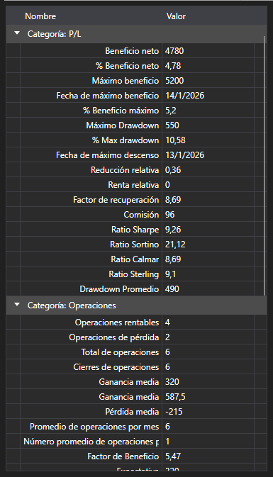

# Estadísticas

[StrategiesStatisticsPanel](xref:StockSharp.Xaml.StrategiesStatisticsPanel) - tabla para mostrar parámetros y estadísticas de estrategias.



**Propiedades y métodos principales**

- [StrategiesStatisticsPanel.SelectedStrategy](xref:StockSharp.Xaml.StrategiesStatisticsPanel.SelectedStrategy) - estrategia seleccionada.
- [StrategiesStatisticsPanel.SelectedStrategies](xref:StockSharp.Xaml.StrategiesStatisticsPanel.SelectedStrategies) - estrategias seleccionadas.
- [StrategiesStatisticsPanel.AddStrategy](xref:StockSharp.Xaml.StrategiesStatisticsPanel.AddStrategy(StockSharp.Algo.Strategies.Strategy))**(**estrategia [StockSharp.Algo.Strategies.Strategy](xref:StockSharp.Algo.Strategies.Strategy) **)** - agrega estrategias a la tabla.
- [StrategiesStatisticsPanel.SetColumnVisibility](xref:StockSharp.Xaml.StrategiesStatisticsPanel.SetColumnVisibility(System.String,System.Windows.Visibility))**(**nombre [System.String](xref:System.String), visibilidad [System.Windows.Visibility](xref:System.Windows.Visibility) **)** - establece la visibilidad de las columnas en la tabla.

A continuación se muestra el fragmento de código con su uso. El ejemplo de código está tomado de *Samples\/Testing\/SampleHistoryTestingParallel*. 

```xaml
<Window x:Class="SampleHistoryTestingParallel.MainWindow"
		xmlns="http://schemas.microsoft.com/winfx/2006/xaml/presentation"
		xmlns:x="http://schemas.microsoft.com/winfx/2006/xaml"
		xmlns:loc="clr-namespace:StockSharp.Localization;assembly=StockSharp.Localization"
		xmlns:charting="http://schemas.stocksharp.com/xaml"
		Title="{x:Static loc:LocalizedStrings.XamlStr563}" Height="430" Width="525">
	
	<Grid>
		<Grid.ColumnDefinitions>
			<ColumnDefinition Width="100" />
			<ColumnDefinition Width="*" />
			<ColumnDefinition Width="Auto" />
		</Grid.ColumnDefinitions>
		<Grid.RowDefinitions>
			<RowDefinition Height="Auto" />
			<RowDefinition Height="10" />
			<RowDefinition Height="Auto" />
			<RowDefinition Height="10" />
			<RowDefinition Height="*" />
		</Grid.RowDefinitions>
		<Label Grid.Column="0" Grid.Row="0" Content="{x:Static loc:LocalizedStrings.XamlStr593}" />
		<TextBox x:Name="HistoryPath" Text="" Grid.Column="1" Grid.Row="0" />
		<Button x:Name="FindPath" Grid.Column="2" Grid.Row="0" Content="..." Width="25" HorizontalAlignment="Left" Click="FindPathClick" />
		<Button x:Name="StartBtn" Content="{x:Static loc:LocalizedStrings.Str2421}" Grid.Row="2" Grid.Column="0" Click="StartBtnClick" />
		<ProgressBar x:Name="TestingProcess" Grid.Column="1" Grid.Row="2" />
		<TabControl Grid.Row="4" Grid.ColumnSpan="3" Grid.Column="0" >
			<TabItem Header="{x:Static loc:LocalizedStrings.Equity}">
				<charting:EquityCurveChart x:Name="Curve" />
			</TabItem>
			<TabItem Header="{x:Static loc:LocalizedStrings.Str436}">
				<charting:StrategiesStatisticsPanel x:Name="Stat" ShowProgress="False"/>
			</TabItem>
		</TabControl>
	</Grid>
</Window>
	  				
```
```cs
var strategies = periods
	.Select(period =>
		{
			...
			// crear estrategia basada en SMA
			var strategy = new SmaStrategy(series, new SimpleMovingAverage { Length = period.Item1 }, new SimpleMovingAverage { Length = period.Item2 })
			{
				Volume = 1,
				Security = security,
				Portfolio = portfolio,
				Connector = connector,
				// de forma predeterminada el intervalo es de 1 min,
				// es excesivo para un rango temporal de varios meses
				UnrealizedPnLInterval = ((stopTime - startTime).Ticks / 1000).To<TimeSpan>()
			};
			...
			var curveItems = Curve.CreateCurve(LocalizedStrings.Str3026Params.Put(period.Item1, period.Item2), period.Item3, DrawStyles.Line);
			strategy.PnLChanged += () =>
			{
				var data = new EquityData
				{
					Time = strategy.CurrentTime,
					Value = strategy.PnL,
				};
				this.GuiAsync(() => curveItems.Add(data));
			};
			Stat.AddStrategies(new[] { strategy });
			return strategy;
		})
		.ToEx(periods.Length);
						
	  				
```

