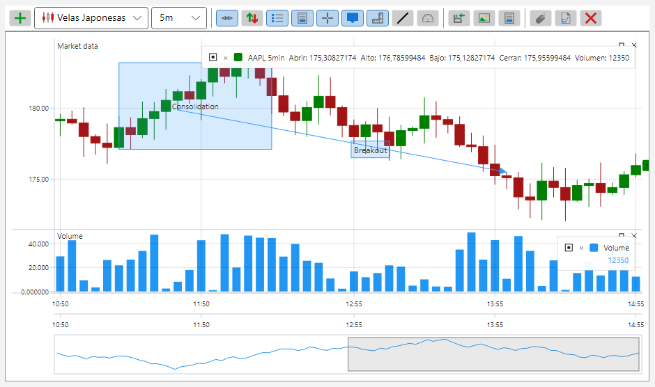
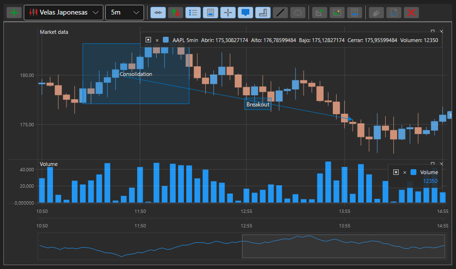

# Temas de los componentes gráficos de S#

Todos los componentes gráficos de S# están diseñados en dos temas \- claro y oscuro. El tema se establece una sola vez, a nivel de aplicación, y todos los componentes lo adoptan a la vez: los colores se toman de los recursos y no se escriben en cada control.

Tema claro:



Tema oscuro:



Para establecer el tema basta con una sola línea:

```cs
...
ThemeExtensions.ApplyDefaultTheme();
...
```

**Métodos principales de [ThemeExtensions](xref:StockSharp.Xaml.ThemeExtensions)**

- [ThemeExtensions.ApplyDefaultTheme](xref:StockSharp.Xaml.ThemeExtensions.ApplyDefaultTheme(System.Boolean)) \- aplica el tema oscuro o el claro.
- [ThemeExtensions.Invert](xref:StockSharp.Xaml.ThemeExtensions.Invert) \- cambia al tema contrario.
- [ThemeExtensions.IsCurrDark](xref:StockSharp.Xaml.ThemeExtensions.IsCurrDark) \- indica si el tema actual es oscuro o no.

El cambio de tema surte efecto de inmediato: no hace falta reiniciar la aplicación, todos los paneles y gráficos abiertos se redibujan con los colores nuevos.

Los colores propios de los componentes bursátiles \- subida y bajada, compra y venta, niveles del libro de órdenes, retícula de las tablas \- viven en un conjunto de recursos aparte y cambian junto con el tema. Por eso un control propio que tome los colores de ese conjunto, en lugar de fijarlos por su cuenta, quedará igual de bien en ambos temas.
