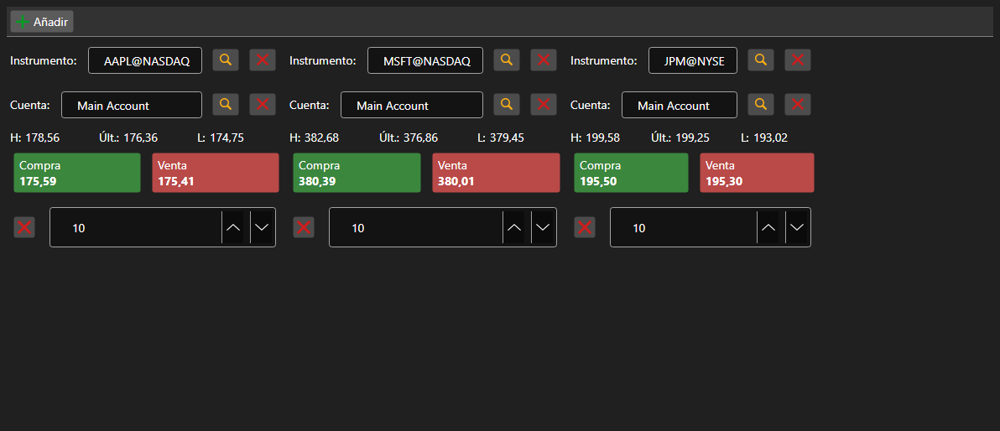

# Conjunto de paneles Comprar\/Vender



[BuySellGrid](xref:StockSharp.Xaml.BuySellGrid) - un contenedor de varios paneles [BuySellPanel](xref:StockSharp.Xaml.BuySellPanel), uno por instrumento. Permite operar varios instrumentos desde una sola pantalla.

**Propiedades principales**

- [BuySellGrid.SecurityProvider](xref:StockSharp.Xaml.BuySellGrid.SecurityProvider) - proveedor de instrumentos para la selección en los paneles.
- [BuySellGrid.Portfolios](xref:StockSharp.Xaml.BuySellGrid.Portfolios) - fuente de carteras.
- [BuySellGrid.MarketDataProvider](xref:StockSharp.Xaml.BuySellGrid.MarketDataProvider) - proveedor de datos de mercado del que los paneles toman los mejores precios.
- [BuySellGrid.Panels](xref:StockSharp.Xaml.BuySellGrid.Panels) - conjunto actual de paneles.

Los paneles se añaden con [BuySellGrid.AddPanel](xref:StockSharp.Xaml.BuySellGrid.AddPanel(StockSharp.BusinessEntities.Security)) y se eliminan con [BuySellGrid.RemovePanel](xref:StockSharp.Xaml.BuySellGrid.RemovePanel(StockSharp.Xaml.BuySellPanel)). El contenedor no registra órdenes: genera el evento `OrderRegistering` con instrumento, cartera, dirección, precio y volumen. La composición de paneles se guarda y restaura con `Save` y `Load`.

A continuación se muestran fragmentos de código con su uso:

```xaml
<Window x:Class="Sample.BuySellWindow"
	xmlns="http://schemas.microsoft.com/winfx/2006/xaml/presentation"
	xmlns:x="http://schemas.microsoft.com/winfx/2006/xaml"
	xmlns:xaml="http://schemas.stocksharp.com/xaml"
	Height="400" Width="900">
	<xaml:BuySellGrid x:Name="BuySellGrid" />
</Window>
```

```cs
// Establecemos las fuentes de datos para todos los paneles
BuySellGrid.SecurityProvider = _connector;
BuySellGrid.MarketDataProvider = _connector;
BuySellGrid.Portfolios = new PortfolioDataSource(_connector);

// Añadimos un panel por instrumento
BuySellGrid.AddPanel(_security);

// Registramos la orden formada por el panel
BuySellGrid.OrderRegistering += (security, portfolio, side, price, volume) =>
{
	_connector.RegisterOrder(new Order
	{
		Security = security,
		Portfolio = portfolio,
		Side = side,
		Price = price,
		Volume = volume,
	});
};
```

## Ver también

[Operaciones](../trading.md)
