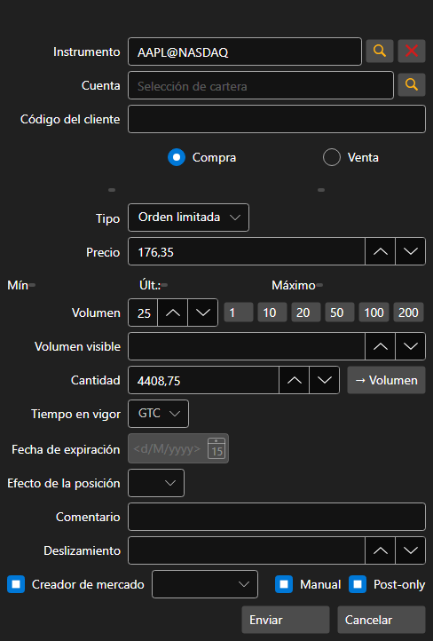

# Creación de una nueva orden

[OrderWindow](xref:StockSharp.Xaml.OrderWindow) - ventana para crear una orden. 



Si la conexión admite el registro de una orden condicional (stop-loss, take-profit), en esta ventana puede registrar una orden condicional con condiciones avanzadas estableciendo la bandera **Condiciones avanzadas**.

**Propiedades básicas**

- [OrderWindow.Portfolios](xref:StockSharp.Xaml.OrderWindow.Portfolios) - lista de portafolios.
- [OrderWindow.MarketDataProvider](xref:StockSharp.Xaml.OrderWindow.MarketDataProvider) - proveedor de datos de mercado.
- [OrderWindow.SecurityProvider](xref:StockSharp.Xaml.OrderWindow.SecurityProvider) - proveedor de información de instrumentos.
- [OrderWindow.Order](xref:StockSharp.Xaml.OrderWindow.Order) - orden creada.

A continuación se muestran fragmentos de código que lo usan. Código de ejemplo tomado de *Samples\/01\_Basic\/03\_Orders*.

```cs
...
private readonly Connector _connector = new Connector();
...
private void NewOrderClick(object sender, RoutedEventArgs e)
{
	var wnd = new OrderWindow
	{
		Order = new Order { Security = SecurityPicker.SelectedSecurity },
		SecurityProvider = _connector,
		MarketDataProvider = _connector,
		Portfolios = new PortfolioDataSource(_connector),
	};
	if (wnd.ShowModal(this))
		_connector.RegisterOrder(wnd.Order);
}
						
	  				
```
