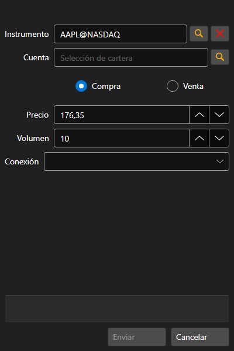

# Creación de una nueva orden stop

[OrderConditionalWindow](xref:StockSharp.Xaml.OrderConditionalWindow) - ventana para crear una orden condicional. 



**Propiedades principales**

- [OrderConditionalWindow.Portfolios](xref:StockSharp.Xaml.OrderConditionalWindow.Portfolios) - lista de portafolios. 
- [OrderConditionalWindow.SecurityProvider](xref:StockSharp.Xaml.OrderConditionalWindow.SecurityProvider) - proveedor de información sobre instrumentos. 
- [OrderConditionalWindow.MarketDataProvider](xref:StockSharp.Xaml.OrderConditionalWindow.MarketDataProvider) - proveedor de datos de mercado. 
- [OrderConditionalWindow.Adapter](xref:StockSharp.Xaml.OrderConditionalWindow.Adapter) - adaptador de mensajes. 
- [OrderConditionalWindow.Order](xref:StockSharp.Xaml.OrderConditionalWindow.Order) - orden creada. 

A continuación se muestra un fragmento de código con su uso. El ejemplo de código está tomado de *Samples\/InteractiveBrokers\/SampleIB*. 

```cs
...
private readonly Connector _connector = new Connector();
...
private void NewStopOrderClick(object sender, RoutedEventArgs e)
{
	var wnd = new OrderConditionalWindow
	{
		Order = new Order
		{
			Security = SecurityPicker.SelectedSecurity,
			Type = OrderTypes.Conditional,
			ExpiryDate = DateTime.Today
		},
		SecurityProvider = _connector,
		MarketDataProvider = _connector,
		Portfolios = new PortfolioDataSource(_connector),
		Adapter = _connector.Adapter
	};
	if (wnd.ShowModal(this))
		_connector.RegisterOrder(wnd.Order);
}
						
	  				
```

