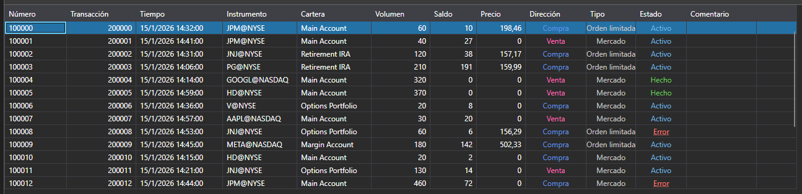

# Órdenes

[OrderGrid](xref:StockSharp.Xaml.OrderGrid) es una tabla para mostrar órdenes y órdenes condicionales. Además, el menú contextual de esta tabla contiene comandos para operaciones con órdenes: registro, reemplazo y cancelación de órdenes. Al seleccionar un elemento del menú se generan los eventos: [OrderGrid.OrderRegistering](xref:StockSharp.Xaml.OrderGrid.OrderRegistering), [OrderGrid.OrderReRegistering](xref:StockSharp.Xaml.OrderGrid.OrderReRegistering) u [OrderGrid.OrderCanceling](xref:StockSharp.Xaml.OrderGrid.OrderCanceling), respectivamente.



> [!TIP]
> La operación en sí (registro, reemplazo, cancelación) no se realiza. El código correspondiente debe escribirse manualmente en los manejadores de eventos.

**Miembros principales**

- [OrderGrid.Orders](xref:StockSharp.Xaml.OrderGrid.Orders) - lista de órdenes.
- [OrderGrid.SelectedOrder](xref:StockSharp.Xaml.OrderGrid.SelectedOrder) - orden seleccionada.
- [OrderGrid.SelectedOrders](xref:StockSharp.Xaml.OrderGrid.SelectedOrders) - órdenes seleccionadas.
- [OrderGrid.AddRegistrationFail](xref:StockSharp.Xaml.OrderGrid.AddRegistrationFail(StockSharp.BusinessEntities.OrderFail))**(**fallo [StockSharp.BusinessEntities.OrderFail](xref:StockSharp.BusinessEntities.OrderFail) **)** - método que agrega un mensaje de error de registro de orden al campo de comentario.
- [OrderGrid.OrderRegistering](xref:StockSharp.Xaml.OrderGrid.OrderRegistering) - evento de registro de orden (ocurre después de seleccionar el elemento correspondiente del menú contextual).
- [OrderGrid.OrderReRegistering](xref:StockSharp.Xaml.OrderGrid.OrderReRegistering) - evento de reemplazo de orden (ocurre después de seleccionar el elemento correspondiente del menú contextual).
- [OrderGrid.OrderCanceling](xref:StockSharp.Xaml.OrderGrid.OrderCanceling) - evento de cancelación de orden (ocurre después de seleccionar el elemento correspondiente del menú contextual).

A continuación se muestran fragmentos de código que demuestran su uso. El ejemplo de código está tomado de *Samples\/01\_Basic\/03\_Orders*.

```xaml
<Window x:Class="Sample.OrdersWindow"
	xmlns="http://schemas.microsoft.com/winfx/2006/xaml/presentation"
	xmlns:x="http://schemas.microsoft.com/winfx/2006/xaml"
	xmlns:loc="clr-namespace:StockSharp.Localization;assembly=StockSharp.Localization"
	xmlns:xaml="http://schemas.stocksharp.com/xaml"
	Title="{x:Static loc:LocalizedStrings.Orders}" Height="410" Width="930">
	<xaml:OrderGrid x:Name="OrderGrid" x:FieldModifier="public" 
					OrderCanceling="OrderGrid_OnOrderCanceling" 
					OrderReRegistering="OrderGrid_OnOrderReRegistering" />
</Window>
	  				
```
```cs
private readonly Connector _connector = new Connector();

private void ConnectClick(object sender, RoutedEventArgs e)
{
	// Otro código durante la conexión...
	
	// Suscribirse al evento de orden recibida
	_connector.OrderReceived += (subscription, order) => 
	{
		// Agregar órdenes a la tabla OrderGrid
		_ordersWindow.OrderGrid.Orders.TryAdd(order);
	};
	
	// Conectar el conector
	_connector.Connect();
}
					
// Cancela todas las órdenes seleccionadas
private void OrderGrid_OnOrderCanceling(IEnumerable<Order> orders)
{
	// Recorrer las órdenes seleccionadas y cancelar cada una
	foreach (var order in orders)
	{
		_connector.CancelOrder(order);
	}
}

// Abre una ventana de edición de órdenes y realiza el reemplazo de la orden seleccionada
private void OrderGrid_OnOrderReRegistering(Order order)
{
	var window = new OrderWindow
	{
		Title = LocalizedStrings.Str2976Params.Put(order.TransactionId),
		SecurityProvider = _connector,
		MarketDataProvider = _connector,
		Portfolios = new PortfolioDataSource(_connector),
		Order = order.ReRegisterClone(newVolume: order.Balance)
	};
	
	if (window.ShowModal(this))
		_connector.ReRegisterOrder(order, window.Order);
}
	  				
```

## Trabajo con órdenes mediante suscripciones

El enfoque moderno para trabajar con órdenes implica usar suscripciones:

```cs
// Suscribirse al evento de orden recibida
_connector.OrderReceived += OnOrderReceived;

// Manejador de orden recibida
private void OnOrderReceived(Subscription subscription, Order order)
{
	// Comprobar si la orden pertenece a la suscripción que nos interesa
	if (subscription == _ordersSubscription)
	{
		// Agregar la orden a la tabla
		_ordersWindow.OrderGrid.Orders.TryAdd(order);
		
		// Procesamiento adicional de la orden
		Console.WriteLine($"Order received: {order.TransactionId}, Status: {order.State}");
		
		// Si la orden está en un estado final, actualizar la UI
		if (order.State == OrderStates.Done || order.State == OrderStates.Failed)
		{
			this.GuiAsync(() => {
				// Actualizar la interfaz para órdenes completadas
			});
		}
	}
}
```

## Cancelación de órdenes

```cs
// Enfoque moderno para cancelar órdenes
private void CancelOrder(Order order)
{
	try
	{
		_connector.CancelOrder(order);
		
		// Registrar la acción
		_logManager.AddInfoLog($"Order cancellation command sent {order.TransactionId}");
	}
	catch (Exception ex)
	{
		_logManager.AddErrorLog($"Error when canceling order: {ex.Message}");
	}
}

// Cancelación masiva de órdenes
private void CancelAllOrders()
{
	var activeOrders = _ordersWindow.OrderGrid.Orders
		.Where(o => o.State == OrderStates.Active)
		.ToArray();
		
	foreach (var order in activeOrders)
	{
		CancelOrder(order);
	}
}
```

## Manejo de errores de registro y cancelación de órdenes

```cs
// Suscribirse a fallos de registro de órdenes
_connector.OrderRegisterFailReceived += OnOrderRegisterFailed;

// Manejador de fallo de registro de orden
private void OnOrderRegisterFailed(Subscription subscription, OrderFail fail)
{
	// Agregar información del error a OrderGrid
	_ordersWindow.OrderGrid.AddRegistrationFail(fail);
	
	// Registrar el error
	_logManager.AddErrorLog($"Order registration error: {fail.Error}");
	
	// Notificar al usuario
	this.GuiAsync(() => 
	{
		MessageBox.Show(this, 
			$"Failed to register order: {fail.Error}", 
			"Registration Error", 
			MessageBoxButton.OK, 
			MessageBoxImage.Error);
	});
}
```

