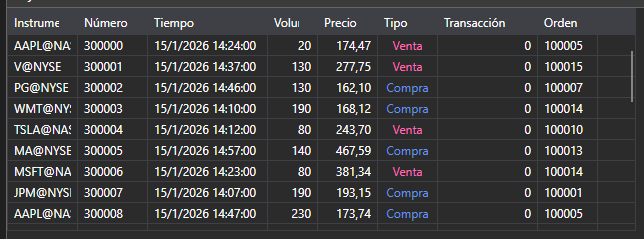

# Operaciones propias

[MyTradeGrid](xref:StockSharp.Xaml.MyTradeGrid) - tabla para mostrar operaciones propias. 



**Miembros principales**

- [MyTradeGrid.Trades](xref:StockSharp.Xaml.MyTradeGrid.Trades) - lista de operaciones.
- [MyTradeGrid.SelectedTrade](xref:StockSharp.Xaml.MyTradeGrid.SelectedTrade) - operación seleccionada.
- [MyTradeGrid.SelectedTrades](xref:StockSharp.Xaml.MyTradeGrid.SelectedTrades) - operaciones seleccionadas.

A continuación se muestra el fragmento de código con su uso. El ejemplo de código está tomado de *Samples\/InteractiveBrokers\/SampleIB.*

```xaml
<Window x:Class="Sample.MyTradesWindow"
	xmlns="http://schemas.microsoft.com/winfx/2006/xaml/presentation"
	xmlns:x="http://schemas.microsoft.com/winfx/2006/xaml"
	xmlns:loc="clr-namespace:StockSharp.Localization;assembly=StockSharp.Localization"
	xmlns:xaml="http://schemas.stocksharp.com/xaml"
	Title="{x:Static loc:LocalizedStrings.MyTrades}" Height="284" Width="644">
	<xaml:MyTradeGrid x:Name="TradeGrid" x:FieldModifier="public" />
</Window>
	  				
```
```cs
private readonly Connector _connector = new Connector();
private void ConnectClick(object sender, RoutedEventArgs e)
{
		...............................................
		_connector.OwnTradeReceived += trade => _myTradesWindow.TradeGrid.Trades.Add(trade);
			
		...............................................
}
	  				
```

