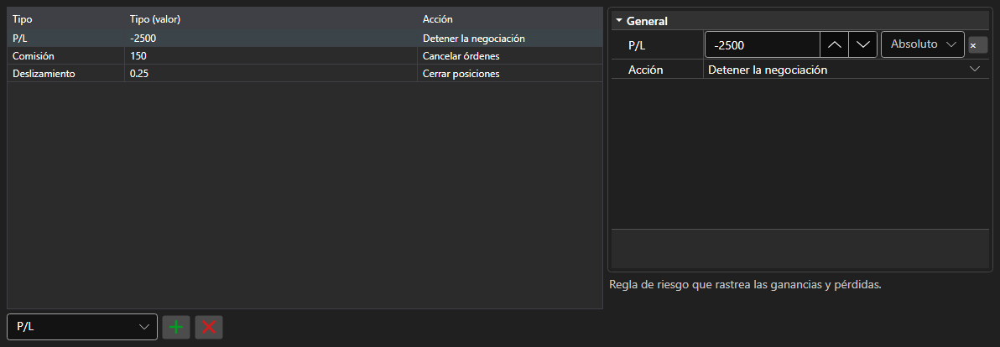

# Reglas de gestión de riesgos



[RiskPanel](xref:StockSharp.Xaml.RiskPanel) - una tabla de reglas de gestión de riesgos. Permite añadir, eliminar y configurar reglas [IRiskRule](xref:StockSharp.Algo.Risk.IRiskRule): cada regla tiene una condición de activación y una acción.

**Propiedades principales**

- [RiskPanel.Rules](xref:StockSharp.Xaml.RiskPanel.Rules) - lista de reglas; la misma lista que usa [IRiskManager](xref:StockSharp.Algo.Risk.IRiskManager).

A la izquierda está la lista de reglas: tipo, valor de la condición y acción al activarse. A la derecha, las propiedades de la regla seleccionada, distintas para cada tipo. Una regla nueva se añade eligiendo su tipo en la lista bajo la tabla y una innecesaria se quita con el botón contiguo. La composición de columnas y sus anchos se guardan con `Save` y `Load`.

A continuación se muestran fragmentos de código con su uso:

```xaml
<Window x:Class="Sample.RiskWindow"
	xmlns="http://schemas.microsoft.com/winfx/2006/xaml/presentation"
	xmlns:x="http://schemas.microsoft.com/winfx/2006/xaml"
	xmlns:xaml="http://schemas.stocksharp.com/xaml"
	Height="400" Width="700">
	<xaml:RiskPanel x:Name="RiskPanel" />
</Window>
```

```cs
// Mostramos las reglas del gestor de riesgos actual
RiskPanel.Rules.AddRange(_connector.RiskManager.Rules);

// Añadimos una regla: detener las operaciones ante pérdidas
RiskPanel.Rules.Add(new RiskPnLRule
{
	PnL = -1000,
	Action = RiskActions.StopTrading,
});

// Devolvemos las reglas editadas al gestor de riesgos
_connector.RiskManager.Rules.Clear();
_connector.RiskManager.Rules.AddRange(RiskPanel.Rules);
```

## Ver también

[Operaciones](../trading.md)
