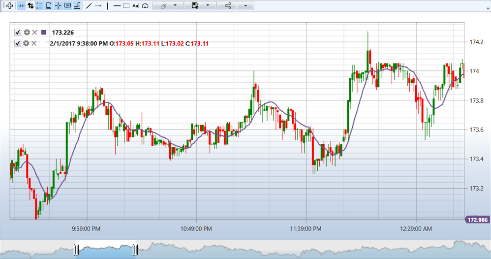

# Agregar un indicador al gráfico

El siguiente ejemplo demuestra cómo agregar un indicador para dibujar en un gráfico:

```cs
private readonly Connector _connector = new Connector();
private Security _security;
private Subscription _candleSubscription;
private SimpleMovingAverage _sma;
readonly TimeSpan _timeFrame = TimeSpan.FromMinutes(1);
private ChartArea _area;
private ChartCandleElement _candlesElem;
private ChartIndicatorElement _longMaElem;

// Inicializando gráfico e indicador
private void InitializeChart()
{
	// _gráfico - StockSharp.Xaml.Charting.Chart
	// Crear un área de gráfico
	_area = new ChartArea();
	_chart.Areas.Add(_area);
	
	// Crear un elemento de gráfico que represente velas
	_candlesElem = new ChartCandleElement();
	_area.Elements.Add(_candlesElem);
	
	// Crear un elemento de gráfico que represente el indicador
	_longMaElem = new ChartIndicatorElement
	{
		Title = "Larga"
	};
	_area.Elements.Add(_longMaElem);
	
	// Creando un indicador
	_sma = new SimpleMovingAverage() { Length = 80 };
	
	// Suscribirse al evento de recepción de velas
	_connector.CandleReceived += OnCandleReceived;
}

// Método para suscribirse a velas.
private void SubscribeToCandles()
{
	// Crear una suscripción a velas con el plazo especificado
	_candleSubscription = new Subscription(
		DataType.TimeFrame(_timeFrame),
		_security)
	{
		MarketData = 
		{
			// Solicitar datos históricos de 30 días
			From = DateTime.Today.Subtract(TimeSpan.FromDays(30)),
			To = DateTime.Now,
			// Recibir solo velas terminadas
			IsFinishedOnly = true
		}
	};
	
	// Iniciando la suscripción
	_connector.Subscribe(_candleSubscription);
}

// Controlador del evento de recepción de velas.
private void OnCandleReceived(Subscription subscription, ICandleMessage candle)
{
	// Comprobando si la vela pertenece a nuestra suscripción
	if (subscription != _candleSubscription)
		return;
	
	// Comprobando el estado de la vela
	if (candle.State != CandleStates.Finished)
		return;
	
	// Procesando la vela con el indicador.
	var longValue = _sma.Process(candle);
	
	// Creando datos para dibujar.
	var data = new ChartDrawData();
	data
		.Group(candle.OpenTime)
			.Add(_candlesElem, candle)
			.Add(_longMaElem, longValue);
	
	// Dibujando en el gráfico en el hilo de la interfaz de usuario
	this.GuiAsync(() => _chart.Draw(data));
}

// Método para darse de baja al cerrar la ventana
private void UnsubscribeFromCandles()
{
	if (_candleSubscription != null)
	{
		_connector.CandleReceived -= OnCandleReceived;
		_connector.UnSubscribe(_candleSubscription);
		_candleSubscription = null;
	}
}
```



## Ejemplo de trabajo con varios indicadores

```cs
private readonly Connector _connector = new Connector();
private Security _security;
private Subscription _candleSubscription;
private SimpleMovingAverage _shortSma;
private SimpleMovingAverage _longSma;
private ChartArea _mainArea;
private ChartArea _indicatorArea;
private ChartCandleElement _candlesElem;
private ChartIndicatorElement _shortSmaElem;
private ChartIndicatorElement _longSmaElem;
private RelativeStrengthIndex _rsi;
private ChartIndicatorElement _rsiElem;

// Inicializando gráfico e indicadores
private void InitializeChartWithMultipleIndicators()
{
	// Creando el área principal para velas y medias móviles.
	_mainArea = new ChartArea();
	_chart.Areas.Add(_mainArea);
	
	// Creando un área para RSI
	_indicatorArea = new ChartArea();
	_chart.Areas.Add(_indicatorArea);
	
	// Crear elementos de gráfico
	_candlesElem = new ChartCandleElement();
	_shortSmaElem = new ChartIndicatorElement { Title = "SMA (corta)" };
	_longSmaElem = new ChartIndicatorElement { Title = "SMA (larga)" };
	_rsiElem = new ChartIndicatorElement { Title = "RSI" };
	
	// Establecer colores de elementos
	_shortSmaElem.Color = Colors.Red;
	_longSmaElem.Color = Colors.Blue;
	_rsiElem.Color = Colors.Green;
	
	// Agregar elementos a sus respectivas áreas
	_mainArea.Elements.Add(_candlesElem);
	_mainArea.Elements.Add(_shortSmaElem);
	_mainArea.Elements.Add(_longSmaElem);
	_indicatorArea.Elements.Add(_rsiElem);
	
	// Creando indicadores
	_shortSma = new SimpleMovingAverage { Length = 9 };
	_longSma = new SimpleMovingAverage { Length = 20 };
	_rsi = new RelativeStrengthIndex { Length = 14 };
	
	// Suscribirse al evento de recepción de velas
	_connector.CandleReceived += OnCandleReceivedMultipleIndicators;
	
	// Creando una suscripción a velas.
	_candleSubscription = new Subscription(
		DataType.TimeFrame(TimeSpan.FromMinutes(5)),
		_security)
	{
		MarketData = 
		{
			From = DateTime.Today.Subtract(TimeSpan.FromDays(30)),
			To = DateTime.Now,
			IsFinishedOnly = true
		}
	};
	
	// Iniciando la suscripción
	_connector.Subscribe(_candleSubscription);
}

// Controlador del evento de recepción de velas para múltiples indicadores
private void OnCandleReceivedMultipleIndicators(Subscription subscription, ICandleMessage candle)
{
	// Comprobando si la vela pertenece a nuestra suscripción
	if (subscription != _candleSubscription)
		return;
	
	if (candle.State != CandleStates.Finished)
		return;
	
	// Procesando la vela con indicadores.
	var shortSmaValue = _shortSma.Process(candle);
	var longSmaValue = _longSma.Process(candle);
	var rsiValue = _rsi.Process(candle);
	
	// Creando datos para dibujar.
	var data = new ChartDrawData();
	data
		.Group(candle.OpenTime)
			.Add(_candlesElem, candle)
			.Add(_shortSmaElem, shortSmaValue)
			.Add(_longSmaElem, longSmaValue)
			.Add(_rsiElem, rsiValue);
	
	// Dibujando en el gráfico en el hilo de la interfaz de usuario
	this.GuiAsync(() => _chart.Draw(data));
}
```

## Véase también

[Componentes para crear gráficos](../graphical_user_interface/charts.md)