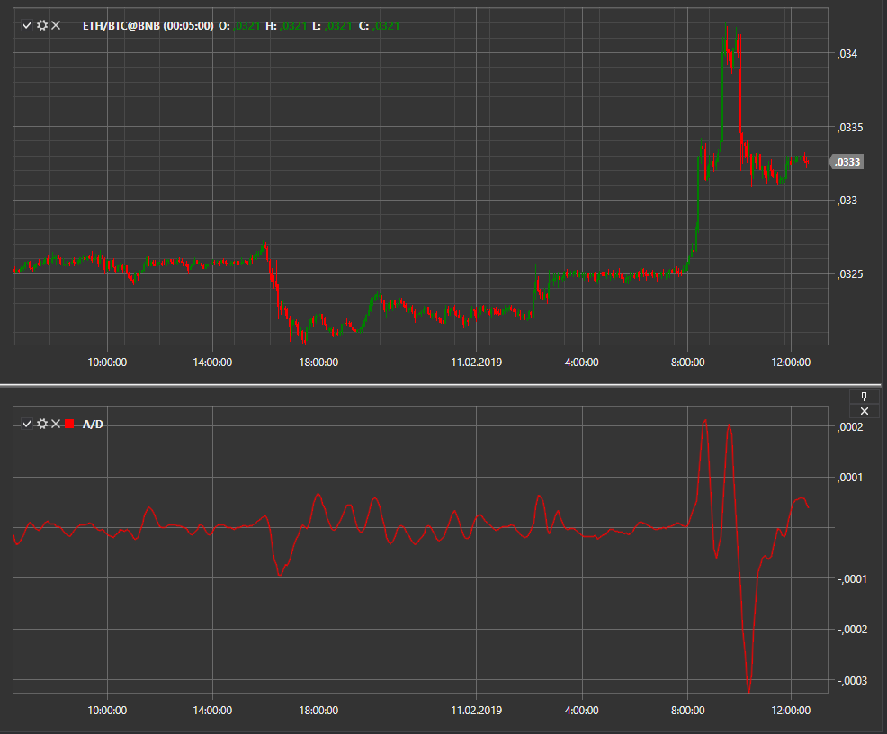

# A/D

**Acceleration/Deceleration (A/D)** es un oscilador creado por Bill Williams. Mide la aceleración y desaceleración del impulso de la tendencia.

Para utilizar el indicador, se debe utilizar la clase [Acceleration](xref:StockSharp.Algo.Indicators.Acceleration).
##### Cálculo

El histograma A/D es la diferencia entre el valor del histograma 5/34 de fuerza motriz y el promedio móvil simple de 5 períodos tomado de este histograma. Los valores se toman para el oscilador clásico y en la configuración siempre es posible especificar sus propios parámetros.

PRECIO MEDIO = (ALTO + BAJO) / 2
AO = SMA (PRECIO MEDIO, 5) - SMA (PRECIO MEDIO, 34)
A/D = AO - SMA (AO, 5)

donde:

PRECIO MEDIO — precio medio;
ALTO — el precio más alto de la barra;
BAJO — el precio más bajo de la barra;
SMA — media móvil simple;
AO — Indicador [oscilador asombroso](ao.md).

Los parámetros se establecen como valores de períodos SMA.

## Véase también

[Alligator](alligator.md)
