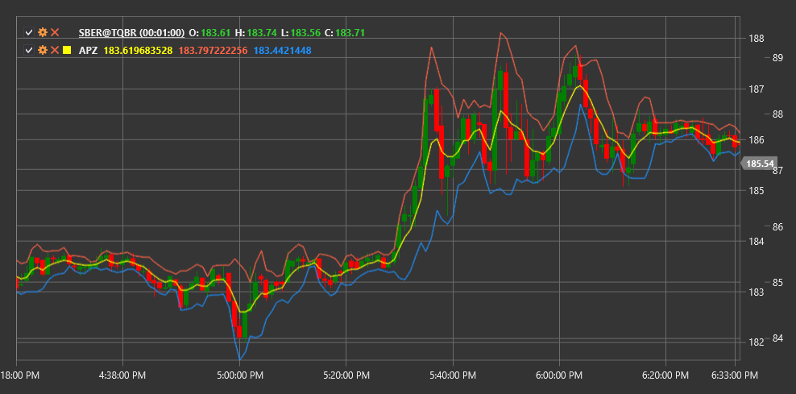

# APZ

**zona de precio adaptativa (APZ)** es un indicador técnico desarrollado por Lee Leibfarth que crea zonas dinámicas de soporte y resistencia, adaptándose a la volatilidad del mercado.

Para utilizar el indicador, debe utilizar la clase [AdaptivePriceZone](xref:StockSharp.Algo.Indicators.AdaptivePriceZone).

## Descripción

El indicador APZ consta de dos líneas (superior e inferior) que forman una zona de precios alrededor del precio medio. Esta zona se expande y contrae dependiendo de la volatilidad actual del mercado. Cuando el mercado se vuelve más volátil, la zona se expande; cuando la volatilidad disminuye, la zona se estrecha.

APZ es particularmente útil para:
- Identificar posibles niveles de soporte y resistencia.
- Detectar posibles puntos de inversión de tendencia
- Períodos reveladores de mayor y menor volatilidad
- Creación de sistemas de negociación basados en rupturas de zonas de precios.

## Parámetros

El indicador tiene los siguientes parámetros:
- **Period** - período de cálculo (valor predeterminado: 5)
- **BandPercentage** - porcentaje del rango para definir el ancho de banda (valor predeterminado: 2%)

## Cálculo

El cálculo de APZ se basa en la media móvil exponencial (EMA) y el rango verdadero promedio (ATR):

1. Primero, calcule el precio EMA para el período especificado:
   ```
   EMA = media móvil exponencial del precio durante Period
   ```

2. Luego calcule la volatilidad usando ATR:
   ```
   Volatilidad = media móvil exponencial de ATR durante Period
   ```

3. Las líneas APZ superior e inferior se calculan de la siguiente manera:
   ```
   línea superior = EMA + (Volatilidad * BandPercentage)
   línea inferior = EMA - (Volatilidad * BandPercentage)
   ```

Cuando el precio está por encima de la línea superior APZ, esto puede considerarse una tendencia alcista. Cuando el precio está por debajo de la línea inferior APZ, esto puede indicar una tendencia a la baja. Cuando el precio se mueve dentro de la zona APZ, el mercado puede estar en una fase de consolidación o de movimiento lateral.



## Véase también

[BollingerBands](bollinger_bands.md)
[KeltnerChannels](keltner_channels.md)
[DonchianChannels](donchian_channels.md)
