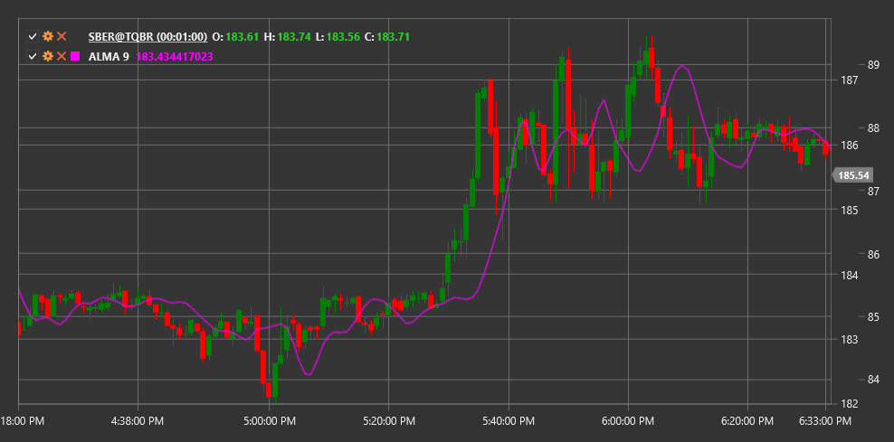

# ALMA

**Media móvil de Arnaud Legoux (ALMA)** es un indicador desarrollado por Arnaud Legoux y optimizado para eliminar el ruido del mercado y reducir el retraso de la señal.

Para utilizar el indicador, debe utilizar la clase [ArnaudLegouxMovingAverage](xref:StockSharp.Algo.Indicators.ArnaudLegouxMovingAverage).

## Descripción

ALMA combina las ventajas de dos enfoques de suavizado de datos:
1. Eliminar el ruido del mercado (como la mayoría de las medias móviles)
2. Minimizar el retraso (típico de muchos indicadores de suavizado)

El indicador ALMA utiliza una distribución normal (gaussiana) como función de peso, que se puede ajustar utilizando parámetros de compensación y sigma. Esto la convierte en una herramienta muy flexible y eficaz para el análisis técnico.

ALMA se utiliza para:
- Determinando la tendencia actual
- Identificar puntos de reversión
- Creación de sistemas de trading basados en cruces.

## Parámetros

El indicador tiene los siguientes parámetros:
- **Length** - período de cálculo (número de velas a analizar)
- **Sigma** - sigma, un parámetro que controla la forma de la curva gaussiana (valor recomendado: 6)
- **Offset** - offset, un parámetro que controla el suavizado y la velocidad de respuesta (valor recomendado: 0,85)

## Cálculo

El cálculo de ALMA se produce en varias etapas:

1. Determinar pesos para cada punto de datos en la ventana según la distribución normal (gaussiana):
   ```
   m = floor(Offset * (Length - 1))
   s = Length / Sigma
   
   Para cada i de 0 a Length-1:
   w(i) = exp(-((i - m)^2) / (2 * s^2))
   ```

2. Normalización de pesos:
   ```
   Sum_of_weights = suma de todos los w(i)
   
   Para cada i de 0 a Length-1:
   w_norm(i) = w(i) / Sum_of_weights
   ```

3. Calculando ALMA como suma ponderada:
   ```
   ALMA = sum(Price(t-i) * w_norm(i)) para todo i de 0 a Length-1
   ```

donde:
- Length - ALMA período
- Offset - parámetro de compensación (de 0 a 1)
- Sigma - parámetro sigma (normalmente de 2 a 8)



## Véase también

[SMA](sma.md)
[EMA](ema.md)
[T3MA](t3_moving_average.md)
[ZLEMA](zero_lag_exponential_moving_average.md)
