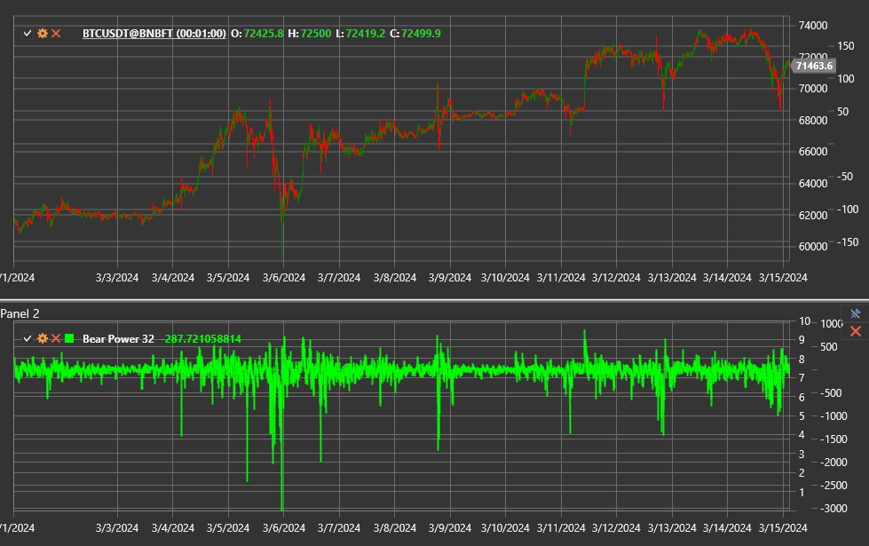

# fuerza bajista

**fuerza bajista** es parte del sistema de rayos de Elder de Alexander Elder y muestra la fuerza de los vendedores en comparación con una media móvil
exponencial (EMA). Mide hasta qué punto los mínimos intradiarios caen por debajo del precio promedio y destaca los momentos en los que los bajistas pierden el control.

Utilice la clase [BearPower](xref:StockSharp.Algo.Indicators.BearPower) para acceder al indicador.

## Descripción

El indicador se calcula como la diferencia entre el mínimo de la barra y el valor EMA:

`fuerza bajista = Low − EMA`.

- Las lecturas negativas confirman la presión vendedora.
- Los valores crecientes hacia cero o por encima de cero indican un debilitamiento de los bajistas y una posible reversión alcista.
- Las caídas profundas a menudo preceden a los rebotes, especialmente durante las ventas masivas provocadas por el pánico.

## Parámetros

fuerza bajista hereda la configuración de [ExponentialMovingAverage](xref:StockSharp.Algo.Indicators.ExponentialMovingAverage):

- **Length** — Período EMA.
- **Alpha** (opcional): coeficiente de suavizado si el EMA está configurado de esta manera.

## Uso

- Busque reversiones cuando fuerza bajista suba después de un mínimo extremo mientras que EMA comienza a subir.
- El cruce de la línea cero puede confirmar un cambio en la tendencia predominante.
- Combine fuerza bajista con [fuerza alcista](bull_power.md) y el precio EMA para crear el indicador [rayos de Elder](elder_ray.md) completo.

## Véase también

[fuerza alcista](bull_power.md)
[rayos de Elder](elder_ray.md)
[Media móvil exponencial](ema.md)
