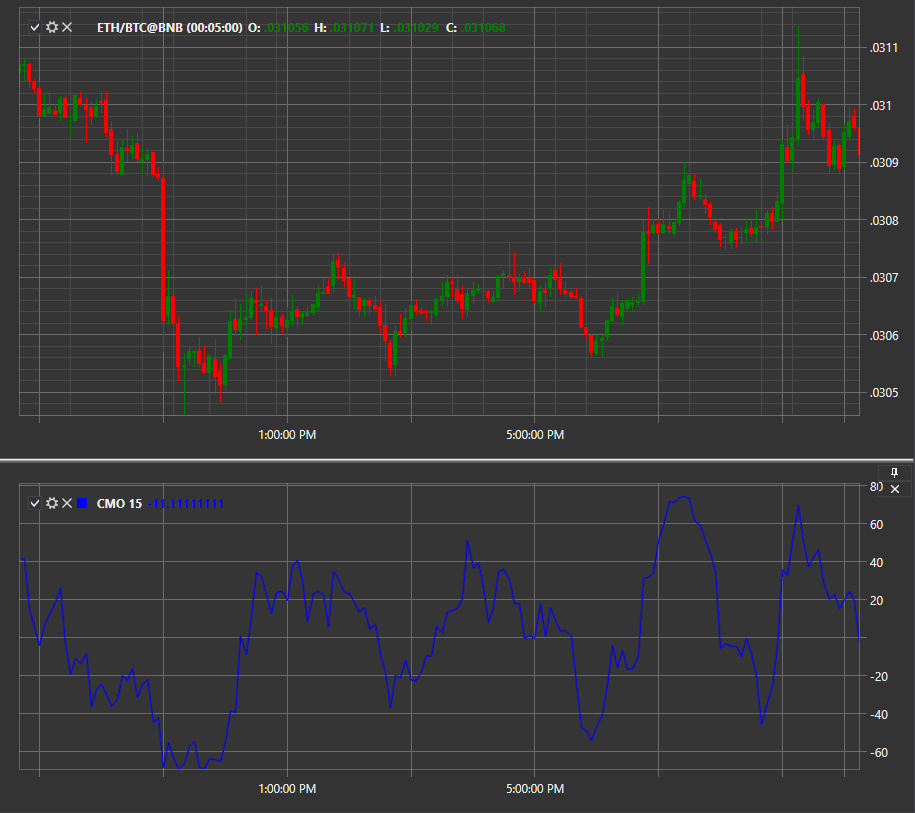

# CMO

**oscilador de momentum de Chande (CMO)** es una modificación del indicador impulso. El inventor de CMO es el operador Tushar Chande.

Para utilizar el indicador, debe utilizar la clase [ChandeMomentumOscillator](xref:StockSharp.Algo.Indicators.ChandeMomentumOscillator).

## Contenido recomendado

[CCI](cci.md)
