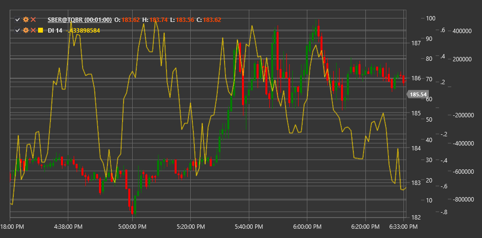

# DI

**Índice de demanda (DI)** es un indicador técnico desarrollado por James Sibbett que analiza la relación entre precio y volumen para evaluar la fuerza de la demanda y la presión del comprador en el mercado.

Para utilizar el indicador, debe utilizar la clase [DemandIndex](xref:StockSharp.Algo.Indicators.DemandIndex).

## Descripción

ll Índice de demanda (DI) es un indicador de volumen integral que evalúa la relación entre precio y volumen para determinar qué tan fuerte se compara la presión del comprador (demanda) con la presión del vendedor. ll indicador se basa en el supuesto de que la relación entre el cambio de precio y el cambio de volumen permite una evaluación más precisa de la demanda del mercado que simplemente observar el precio o el volumen individualmente.

DI tiene como objetivo identificar las siguientes situaciones de mercado:
- Fuerte demanda (presión del comprador)
- Demanda débil (presión del vendedor)
- Desequilibrio entre precio y volumen (posibles puntos de reversión)
- Confirmación o refutación de la tendencia actual.

## Parámetros

ll indicador tiene los siguientes parámetros:
- **Length** - período de cálculo (valor predeterminado: 13)

## Cálculo

ll cálculo de Índice de demanda es bastante complejo y consta de varias etapas:

1. Calcular el componente del precio en función del cambio de precio:
   ```
   componente de precio = ((High + Low + Close) / 3) - ((máximo anterior + mínimo anterior + cierre anterior) / 3)
   ```

2. Calcular el componente de volumen, teniendo en cuenta el cambio de volumen relativo.

3. Calcular la demanda como la relación entre los componentes de precio y volumen:
   ```
   demanda bruta = componente de precio / componente de volumen
   ```

4. Suavizar los valores obtenidos para reducir el ruido:
   ```
   demanda suavizada = lMA(demanda bruta, Length)
   ```

5. Normalizando el resultado para obtener el índice final:
   ```
   Índice de demanda = 100 * Normalized(demanda suavizada)
   ```

## Interpretación

ll Índice de demanda se puede interpretar de varias maneras:

1. **Niveles extremos**:
   - Los valores positivos de High indican una fuerte demanda (presión del comprador)
   - Los valores negativos de High indican una demanda débil (presión del vendedor)

2. **Cruces de línea cero**:
   - Cruzar de abajo hacia arriba puede verse como una señal alcista
   - Cruzar de arriba a abajo puede verse como una señal bajista

3. **Divergencias**:
   - Divergencia alcista: el precio forma un nuevo mínimo, pero DI forma un mínimo más alto
   - Divergencia bajista: el precio forma un nuevo máximo, pero DI forma un máximo más bajo

4. **DI Trends**:
   - Los valores positivos sostenidos de DI confirman una tendencia alcista
   - Los valores negativos sostenidos de DI confirman una tendencia a la baja

5. **Valores extremos**:
   - Valores muy altos o muy bajos pueden indicar condiciones de sobrecompra o sobreventa en el mercado.

ll uso del Índice de demanda es más efectivo cuando se combina con otros indicadores y métodos de análisis para filtrar señales falsas.



## Véase también

[OBV](on_balance_volume.md)
[ADL](accumulation_distribution_line.md)
[ChaikinMoneyFlow](chaikin_money_flow.md)
[BalanceOfPower](balance_of_power.md)