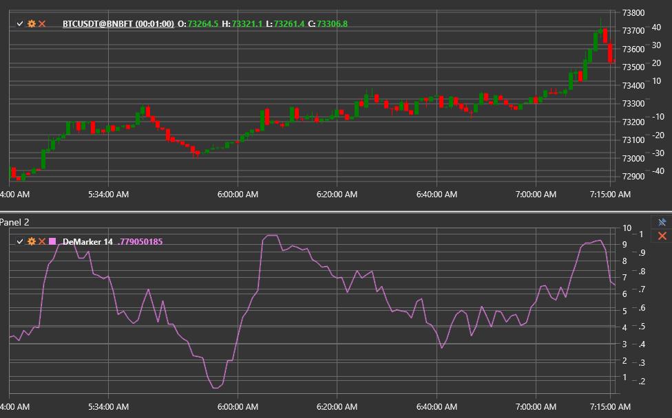

# DeMarker

El indicador **DeMarker (DeM)** evalúa la presión de compra y venta comparando los extremos de la barra actual con la anterior.
uno. Destaca las zonas de sobrecompra y sobreventa y ayuda a detectar posibles puntos de inflexión.

Utilice la clase [DeMarker](xref:StockSharp.Algo.Indicators.DeMarker) para trabajar con este indicador.

## Cálculo

1. Para cada barra, calcule valores intermedios:
   `DeMax = max(High − PreviousHigh, 0)`
   `DeMin = max(PreviousLow − Low, 0)`
2. Suaviza `DeMax` y `DeMin` con una media móvil de longitud **Length**.
3. Calcular el valor final:
   `DeMarker = SMA(DeMax, Length) / (SMA(DeMax, Length) + SMA(DeMin, Length))`.

La salida se normaliza entre 0 y 1.

## Parámetros

- **Length** — período de suavizado que controla la capacidad de respuesta del indicador.

## Interpretación

- **Above 0.7** — condiciones de sobrecompra, posible corrección a la baja.
- **Below 0.3**: condiciones de sobreventa, posible reversión al alza.
- **Divergencia** entre el precio y el indicador advierte sobre un cambio de tendencia.

DeMarker se puede utilizar para entradas de contratendencia, así como para confirmar señales de osciladores de impulso.

## Véase también

[RSI](rsi.md)
[Oscilador estocástico](stochastic_oscillator.md)
[Impulso](momentum.md)
