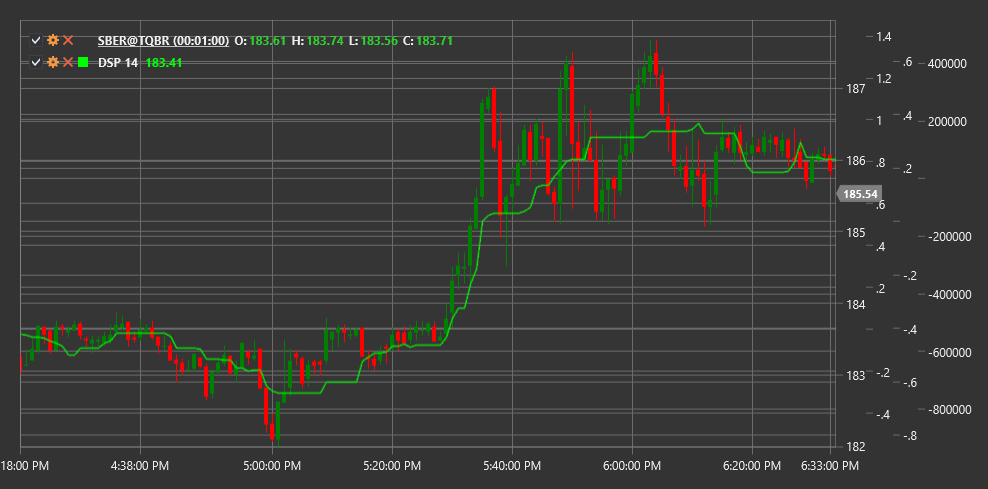

# DSP

**precio sintético sin tendencia (DSP)** es un indicador técnico que elimina la tendencia general de una serie de precios, lo que permite a los operadores centrarse en las fluctuaciones de precios a corto plazo.

Para utilizar el indicador, debe utilizar la clase [DetrendedSyntheticPrice](xref:StockSharp.Algo.Indicators.DetrendedSyntheticPrice).

## Descripción

El indicador DSP fue desarrollado para eliminar la tendencia a largo plazo de un gráfico de precios, permitiendo a los operadores ver más claramente los ciclos y oscilaciones a corto plazo. Es particularmente útil para identificar oportunidades de negociación a corto plazo que pueden estar ocultas por la tendencia dominante.

La idea principal de DSP es que al eliminar la tendencia de la serie de precios, resulta más fácil identificar los componentes cíclicos del movimiento de precios. Esto hace que el indicador sea especialmente valioso para los operadores especializados en operaciones a corto plazo y que utilizan patrones cíclicos.

DSP es útil para:
- Identificar ciclos de mercado a corto plazo
- Determinación de posibles puntos de reversión
- Detectar divergencias con el precio
- Crear sistemas de negociación basados en la naturaleza cíclica de los mercados.

## Parámetros

El indicador tiene los siguientes parámetros:
- **Length** - período de cálculo (valor predeterminado: 10-20 períodos)

## Cálculo

Calcular el precio sintético sin tendencia implica los siguientes pasos:

1. Calcule el promedio móvil del precio durante el período especificado:
   ```
   MA = SMA(Price, Length)
   ```

2. Determine la compensación para el cálculo del precio sintético:
   ```
   Offset = (Length / 2) + 1
   ```

3. Calcule el precio sintético restando la media móvil desplazada del precio actual:
   ```
   DSP = Price - MA[desplazada (Length/2) + 1 periodos hacia atrás]
   ```

donde:
- Price - precio actual (normalmente precio de cierre)
- MA - media móvil simple
- Length - período de cálculo seleccionado

## Interpretación

El indicador DSP oscila alrededor de la línea cero y se puede interpretar de la siguiente manera:

1. **Cruces de línea cero**:
   - Cuando DSP cruza la línea cero de abajo hacia arriba, puede verse como una señal alcista.
   - Cuando DSP cruza la línea cero de arriba a abajo, puede verse como una señal bajista.

2. **Extremos del indicador**:
   - Cuando DSP alcanza valores extremadamente altos, puede indicar condiciones de sobrecompra en el mercado.
   - Cuando DSP alcanza valores extremadamente bajos, puede indicar condiciones de sobreventa en el mercado.

3. **Análisis cíclico**:
   - Se pueden utilizar oscilaciones regulares DSP para determinar la periodicidad del ciclo de mercado.
   - Los cambios en la amplitud de la oscilación pueden indicar cambios en la dinámica del mercado

4. **Divergencias**:
   - Divergencia alcista: el precio forma un nuevo mínimo, mientras que DSP forma un mínimo más alto
   - Divergencia bajista: el precio forma un nuevo máximo, mientras que DSP forma un máximo más bajo

5. **Formación de patrones**:
   - Se pueden formar patrones técnicos (cabeza y hombros, doble fondo, etc.) en el gráfico DSP, lo que podría proporcionar señales de negociación adicionales.



## Véase también

[DetrendedPriceOscillator](dpo.md)
[CenterOfGravityOscillator](center_of_gravity_oscillator.md)
[SineWave](sine_wave.md)
