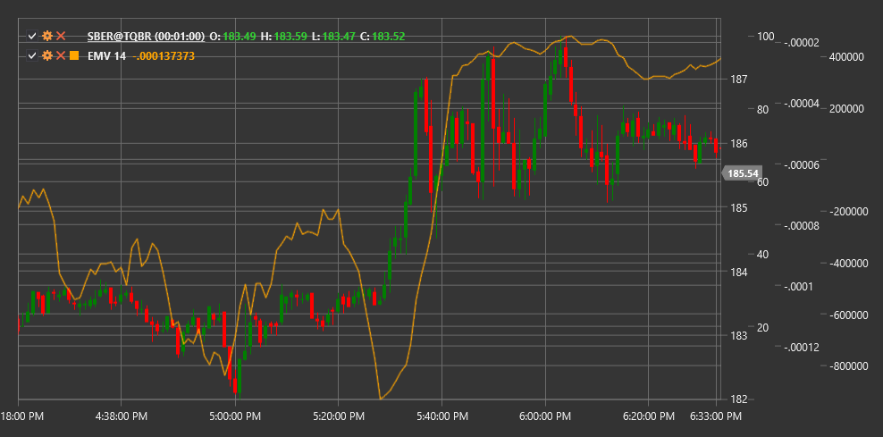

# EMV

**Facilidad de movimiento (EMV)** es un indicador técnico desarrollado por Richard Arms que correlaciona el cambio de precio con el volumen para evaluar la facilidad con la que el precio sube o baja.

Para utilizar el indicador, debe utilizar la clase [EaseOfMovement](xref:StockSharp.Algo.Indicators.EaseOfMovement).

## Descripción

El indicador Facilidad de movimiento (EMV) fue creado para medir la relación entre el movimiento del precio y el volumen. El concepto principal del indicador es que en una tendencia alcista, el precio debería subir fácilmente con poco volumen, mientras que en una tendencia a la baja, el precio debería bajar fácilmente también con poco volumen.

EMV combina información sobre el rango de precios, el cambio de precios y el volumen para crear una medida de la "facilidad" del movimiento de precios. Los valores positivos de EMV indican que el precio está aumentando con relativa facilidad, mientras que los valores negativos indican que el precio está cayendo con relativa facilidad.

El indicador es particularmente útil para:
- Confirmar la fortaleza o debilidad de la tendencia actual
- Identificar posibles puntos de reversión
- Detectar divergencias con el precio
- Evaluación de la "calidad" del movimiento de precios considerando el volumen

## Parámetros

El indicador tiene los siguientes parámetros:
- **Length** - período de suavizado (valor predeterminado: 14)

## Cálculo

El cálculo del indicador Facilidad de movimiento implica los siguientes pasos:

1. Calcular el movimiento del punto medio:
   ```
   Punto medio = (High + Low) / 2
   Movimiento del punto medio = Punto medio[current] - Punto medio[previous]
   ```

2. Calcular la relación de caja (coeficiente volumen-distancia):
   ```
   Relación volumen-distancia = Volume / (High - Low)
   ```

3. Calcule EMV de período único:
   ```
   EMV de 1 periodo = Movimiento del punto medio / Relación volumen-distancia
   ```

4. Suave para obtener EMV final:
   ```
   EMV = SMA(EMV de 1 periodo, Length)
   ```

donde:
- High - precio más alto de la vela
- Low - el precio más bajo de la vela
- Volume - volumen de operaciones
- SMA - media móvil simple

## Interpretación

El indicador EMV se puede interpretar de la siguiente manera:

1. **Cruces de línea cero**:
   - Cruzar de abajo hacia arriba (de valores negativos a positivos) puede verse como una señal alcista, lo que indica que el precio está comenzando a subir con facilidad.
   - Cruzar de arriba a abajo (de valores positivos a negativos) puede verse como una señal bajista, lo que indica que el precio está comenzando a bajar con facilidad.

2. **Valores extremos**:
   - Los valores positivos altos indican que el precio sube muy fácilmente (con poco volumen)
   - Los valores negativos extremos indican que el precio está bajando muy fácilmente (con poco volumen)

3. **Divergencias**:
   - Divergencia alcista: el precio forma un nuevo mínimo, mientras que EMV forma un mínimo más alto (puede indicar una posible reversión alcista)
   - Divergencia bajista: el precio forma un nuevo máximo, mientras que EMV forma un máximo más bajo (puede indicar una posible reversión a la baja)

4. **EMV Trends**:
   - Los valores positivos sostenidos confirman una tendencia alcista
   - Los valores negativos sostenidos confirman una tendencia a la baja
   - Las oscilaciones alrededor de cero pueden indicar una tendencia lateral o una consolidación

5. **Análisis de volumen**:
   - Si el precio sube con un EMV positivo, esto confirma la fuerza del movimiento alcista.
   - Si el precio cae con un EMV negativo, esto confirma la fuerza del movimiento a la baja.
   - Si el precio sube con un EMV negativo o cae con un EMV positivo, esto puede indicar la inestabilidad del movimiento actual.



## Véase también

[ForceIndex](force_index.md)
[BalanceOfPower](balance_of_power.md)
[ADL](accumulation_distribution_line.md)
[OBV](on_balance_volume.md)