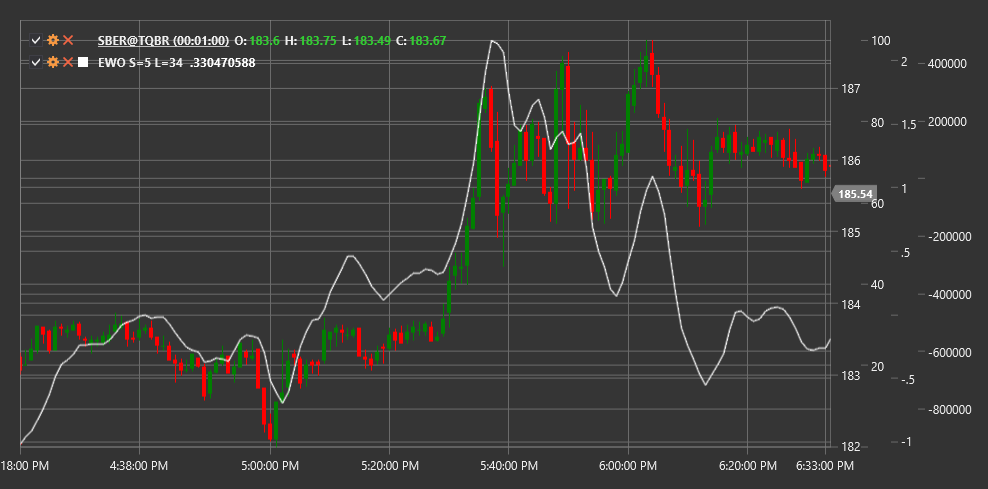

# EWO

**oscilador de ondas de Elliott (EWO)** es un indicador técnico basado en la teoría de ondas de Elliott que ayuda a los operadores a determinar la estructura de las ondas y los posibles puntos de reversión del mercado.

Para utilizar el indicador, debe utilizar la clase [ElliotWaveOscillator](xref:StockSharp.Algo.Indicators.ElliotWaveOscillator).

## Descripción

El oscilador de ondas de Elliott (EWO) fue desarrollado para ayudar a los operadores a aplicar la teoría de ondas de Elliott en el análisis de mercado. La teoría de ondas de Elliott supone que los mercados se mueven en ciclos predecibles que constan de cinco ondas en la dirección de la tendencia (ondas de impulso) y tres ondas en contra de la tendencia (ondas correctivas).

EWO se basa en la diferencia entre promedios móviles rápidos y lentos y está diseñado para identificar ondas impulsivas y correctivas según la teoría de Elliott. Ayuda a determinar cuándo el mercado se encuentra en una fase de impulso o correctiva y sugiere posibles puntos de reversión.

El oscilador de ondas de Elliott es particularmente útil para:
- Identificación de la estructura actual de las ondas de Elliott
- Determinación de posibles finales de ondas impulsivas y correctivas.
- Confirmación del análisis de onda manual
- Previsión de posibles puntos de reversión

## Parámetros

El indicador tiene los siguientes parámetros:
- **ShortPeriod** - período para la media móvil corta (valor predeterminado: 5)
- **LongPeriod** - período para la media móvil larga (valor predeterminado: 35)

## Cálculo

El cálculo de oscilador de ondas de Elliott es bastante sencillo:

```
EWO = EMA(Close, ShortPeriod) - EMA(Close, LongPeriod)
```

donde:
- EMA - media móvil exponencial
- Close - precio de cierre
- ShortPeriod - período corto (generalmente 5)
- LongPeriod - período largo (normalmente 35)

## Interpretación

El oscilador de ondas de Elliott se puede interpretar de la siguiente manera:

1. **Valores positivos y negativos**:
   - Los valores positivos (EWO por encima de cero) indican que el EMA corto está por encima del EMA largo, lo que a menudo corresponde a una tendencia alcista o una onda de impulso ascendente.
   - Los valores negativos (EWO por debajo de cero) indican que el EMA corto está por debajo del EMA largo, lo que a menudo corresponde a una tendencia bajista o una onda de impulso bajista.

2. **Cruces de línea cero**:
   - El cruce de la línea cero de abajo hacia arriba puede señalar el inicio de una nueva onda de impulso ascendente
   - El cruce de la línea cero de arriba a abajo puede indicar el inicio de una nueva onda de impulso descendente

3. **Extremos del oscilador**:
   - Los picos y valles del oscilador pueden corresponder al final de las ondas de impulso.
   - Una fase correctiva a menudo sigue a llegar a un extremo

4. **Divergencias**:
   - La divergencia alcista (el precio forma un nuevo mínimo, mientras que EWO forma un mínimo más alto) puede indicar un posible final de una onda de impulso descendente
   - La divergencia bajista (el precio forma un nuevo máximo, mientras que EWO forma un máximo más bajo) puede indicar un posible final de una onda de impulso ascendente

5. **Wave Structure**:
   - En las ondas de impulso (ondas 1, 3, 5), EWO normalmente muestra valores fuertes en la dirección de la tendencia.
   - En las ondas correctivas (ondas 2, 4, A, B, C), EWO generalmente muestra valores más débiles o se mueve en una dirección opuesta a la tendencia principal.

6. **Wave 3 Identification**:
   - La onda 3, que suele ser la onda de impulso más fuerte en la teoría de ondas de Elliott, suele caracterizarse por los valores más altos de EWO.



## Véase también

[EMA](ema.md)
[MACD](macd.md)
[ZigZag](zigzag.md)
[WaveTrendOscillator](wave_trend_oscillator.md)