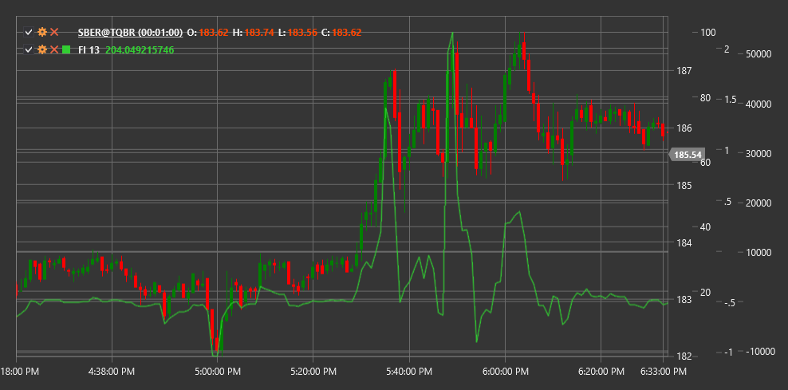

# FI

**Índice de fuerza (FI)** es un indicador técnico desarrollado por el Dr. Alexander Elder que mide la fuerza de cada movimiento de precios en función de su dirección, magnitud y volumen de operaciones.

Para utilizar el indicador, debe utilizar la clase [ForceIndex](xref:StockSharp.Algo.Indicators.ForceIndex).

## Descripción

El Índice de fuerza es un oscilador que mide la fuerza de los "alcistas" (compradores) o "osos" (vendedores) en cada movimiento de precios. Combina tres elementos importantes de la información del mercado: dirección del movimiento de precios, magnitud del movimiento y volumen de operaciones.

La idea principal del indicador es que cuanto mayor sea el cambio de precio y mayor el volumen de operaciones, más fuerte será el movimiento del mercado. Los valores positivos del Índice de fuerza indican predominio del comprador (presión alcista), mientras que los valores negativos indican predominio del vendedor (presión bajista).

El Índice de fuerza es particularmente útil para:
- Determinando la fuerza de la tendencia actual
- Identificar posibles puntos de reversión
- Confirmando brotes
- Detectar divergencias entre el precio y la fuerza del movimiento.

## Parámetros

El indicador tiene los siguientes parámetros:
- **Length** - período de suavizado (valor predeterminado: 13)

## Cálculo

El cálculo del Índice de fuerza implica los siguientes pasos:

1. Calculando el Índice de fuerza de un solo período:
   ```
   Índice de fuerza de 1 periodo = (Close[current] - Close[previous]) * Volume[current]
   ```

2. Suavizado usando una media móvil exponencial (EMA):
   ```
   Índice de fuerza = EMA(Índice de fuerza de 1 periodo, Length)
   ```

donde:
- Close - precio de cierre
- Volume - volumen de operaciones
- EMA - media móvil exponencial
- Length - período de suavizado

## Interpretación

El Índice de fuerza se puede interpretar de varias maneras:

1. **Cruces de línea cero**:
   - La transición de valores negativos a positivos indica una mayor presión alcista y puede verse como una señal de compra.
   - La transición de valores positivos a negativos indica una mayor presión bajista y puede verse como una señal de venta.

2. **Valores extremos**:
   - Los valores positivos altos indican una fuerte presión alcista que puede conducir a condiciones de sobrecompra en el mercado.
   - Los valores negativos extremos indican una fuerte presión bajista que puede llevar a condiciones de sobreventa en el mercado.

3. **Divergencias**:
   - La divergencia alcista (el precio forma un nuevo mínimo, mientras que el Índice de fuerza forma un mínimo más alto) puede indicar una posible reversión alcista
   - La divergencia bajista (el precio forma un nuevo máximo, mientras que el Índice de fuerza forma un máximo más bajo) puede indicar una posible reversión a la baja

4. **Confirmación de tendencia**:
   - Los valores del Índice de fuerza consistentemente positivos confirman la fuerza de una tendencia alcista
   - Los valores del Índice de fuerza consistentemente negativos confirman la fuerza de una tendencia a la baja

5. **Triple uso** (según Anciano):
   - Índice de fuerza de corto plazo (2 días): para identificar oportunidades a corto plazo
   - Índice de fuerza de mediano plazo (13 días): para determinar tendencias y correcciones a mediano plazo
   - Índice de fuerza a largo plazo (100 días): para identificar la tendencia principal

6. **Identificación de correcciones**:
   - En una tendencia alcista, los días con Índice de fuerza negativo pueden indicar correcciones temporales
   - En una tendencia a la baja, los días con Índice de fuerza positivo pueden indicar rebotes temporales



## Véase también

[EMA](ema.md)
[OBV](on_balance_volume.md)
[ADL](accumulation_distribution_line.md)
