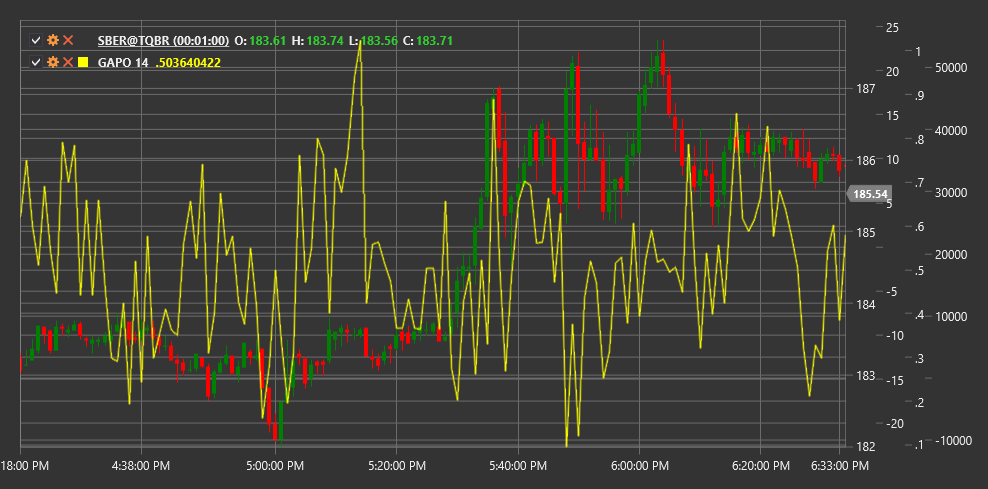

# GAPO

**Gopalakrishnan Range Index (GAPO)** es un indicador técnico desarrollado por Tushar Gopalakrishnan para medir la volatilidad del mercado utilizando una escala logarítmica.

Para utilizar el indicador, debe utilizar la clase [GopalakrishnanRangeIndex](xref:StockSharp.Algo.Indicators.GopalakrishnanRangeIndex).

## Descripción

El Gopalakrishnan Range Index (GAPO) es un indicador de volatilidad que utiliza una escala logarítmica para medir el rango general de precios durante un período específico. Fue desarrollado por Tushar Gopalakrishnan y presentado en la revista "Análisis técnico de acciones y materias primas".

GAPO evalúa los movimientos extremos del mercado midiendo la relación logarítmica entre los precios máximo y mínimo durante un período determinado. Este enfoque permite que el indicador refleje con mayor precisión una mayor volatilidad, especialmente durante períodos de fuertes movimientos de precios.

El indicador GAPO es particularmente útil para:
- Identificar períodos de alta y baja volatilidad
- Detectar posibles puntos de inversión después de movimientos extremos
- Ajuste de parámetros para otros indicadores basados en la volatilidad
- Adaptar las estrategias de trading a las condiciones actuales del mercado.

## Parámetros

El indicador tiene los siguientes parámetros:
- **Length** - período de cálculo (valor predeterminado: 10)

## Cálculo

El cálculo de Gopalakrishnan Range Index es bastante sencillo:

```
GAPO = log(N) * log(Highest High - Lowest Low)
```

donde:
- log - logaritmo natural
- N - número de períodos (Length)
- Highest High: máximo máximo durante el período Length
- Lowest Low: mínimo más bajo durante el período Length

## Interpretación

El Gopalakrishnan Range Index se puede interpretar de la siguiente manera:

1. **Valores absolutos**:
   - Los valores High GAPO indican períodos de alta volatilidad
   - Los valores Low GAPO indican períodos de baja volatilidad
   - Los valores extremadamente altos pueden indicar una posible sobreextensión del mercado y una posible reversión.

2. **GAPO Trends**:
   - Los valores crecientes de GAPO indican una volatilidad creciente
   - Los valores GAPO decrecientes indican una volatilidad decreciente
   - Un salto brusco de GAPO puede señalar el comienzo de un nuevo movimiento de tendencia

3. **Niveles relativos**:
   - Comparar el valor actual de GAPO con sus niveles históricos permite evaluar la volatilidad relativa
   - Valores por encima del percentil 95 del rango histórico pueden indicar volatilidad extrema
   - Los valores por debajo del percentil 5 del rango histórico pueden indicar una volatilidad inusualmente baja

4. **Estrategias de trading**:
   - Durante períodos de alta volatilidad (valores altos de GAPO), puede ser apropiado aumentar el límite de pérdidas y el tamaño objetivo de ganancias.
   - Durante períodos de baja volatilidad (valores bajos de GAPO), las estrategias de negociación de rango pueden ser más adecuadas
   - Los valores extremos de GAPO se pueden utilizar como indicadores contrarios para encontrar puntos de inversión

5. **Combinación con otros indicadores**:
   - GAPO se puede utilizar para filtrar señales de otros indicadores
   - Durante períodos de alta volatilidad, las señales de los indicadores de tendencia pueden ser más confiables
   - Durante períodos de baja volatilidad, las señales del oscilador pueden ser más efectivas



## Véase también

[ATR](atr.md)
[ChoppinessIndex](choppiness_index.md)
[TrueRange](true_range.md)