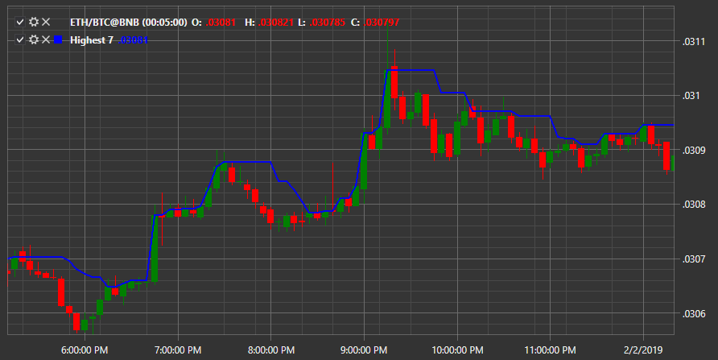

# Valor máximo

El indicador indica **Valor máximo del período**. 

Para utilizar el indicador, debe utilizar la clase [Highest](xref:StockSharp.Algo.Indicators.Highest). 

## Contenido recomendado

[HMA](hma.md)
