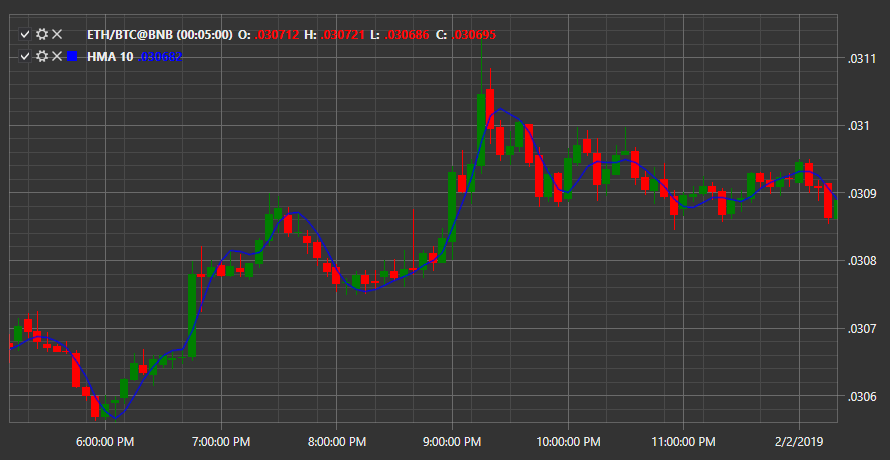

# HMA

**Media móvil de Hull (HMA)** - el indicador muestra la dirección de la tendencia del mercado y representa una media móvil mejorada.

Para utilizar el indicador, debe utilizar la clase [HullMovingAverage](xref:StockSharp.Algo.Indicators.HullMovingAverage). 

## Contenido recomendado

[Ichimoku](ichimoku.md)
