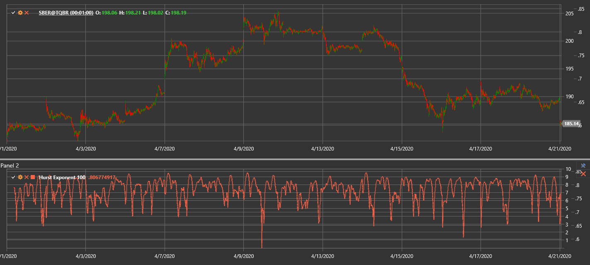

# HurstExponent

**Exponente de Hurst** es una medida estadística que se utiliza para evaluar la tendencia de una serie temporal a tener tendencia o volver a la media.

Para utilizar el indicador, debe utilizar la clase [HurstExponent](xref:StockSharp.Algo.Indicators.HurstExponent).

## Descripción

El exponente de Hurst (H) oscila entre 0 y 1 y describe la memoria a largo plazo de una serie:
- **H > 0.5** indica un comportamiento de tendencia persistente.
- **H < 0.5** muestra una tendencia hacia la reversión a la media.
- **H ≈ 0.5** corresponde a un paseo aleatorio.

Puede ayudar a estimar la eficiencia del mercado y revelar ciclos o tendencias emergentes.

## Parámetros

- **Length**: el número de barras utilizadas en el cálculo.

## Cálculo

Un método común se basa en el enfoque de rango reescalado (R/S):
1. Para cada ventana de puntos `Length`, calcule las desviaciones acumuladas de la media.
2. Encuentre el rango `R` como la diferencia entre la desviación acumulada máxima y mínima.
3. Calcule la desviación estándar `S` de la ventana.
4. Evalúe el rango reescalado `R/S`.
5. Calcule `H` como la pendiente de `log(R/S)` frente a `log(Length)`.

Los valores más altos del exponente sugieren un comportamiento de tendencia más fuerte, mientras que los valores más bajos implican una mayor reversión a la media.

## Véase también

[Media móvil adaptativa fractal](fractal_adaptive_moving_average.md)
[MMI](market_meanness_index.md)
