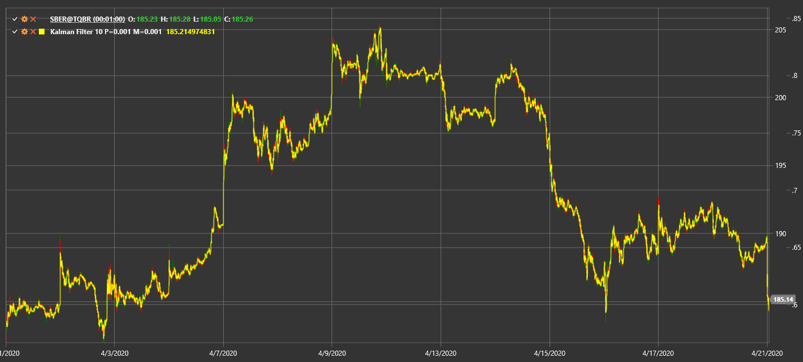

# KalmanFilter

**Kalman Filter** es un algoritmo recursivo que estima el estado subyacente de un sistema a partir de observaciones ruidosas.

Para utilizar el indicador, debe utilizar la clase [KalmanFilter](xref:StockSharp.Algo.Indicators.KalmanFilter).

## Descripción

El Kalman Filter aplica un ciclo de predicción-corrección para suavizar los datos de precios y reducir el ruido del mercado. Se adapta dinámicamente a medida que hay nueva información disponible, lo que lo hace útil para rastrear tendencias en mercados volátiles.

## Parámetros

- **ProcessNoise** – variación esperada en el proceso subyacente.
- **ObservationNoise** – variación esperada en los datos observados.

## Cálculo

En cada paso el filtro realiza:
1. **Prediction** del siguiente estado según la estimación anterior.
2. **Actualizar** de esta predicción utilizando la observación de precios más reciente y las estimaciones de ruido.

Esto produce una estimación optimizada que reacciona rápidamente a los cambios de precios y al mismo tiempo filtra las fluctuaciones a corto plazo.

## Véase también

[Media móvil adaptativa de Kaufman](kama.md)
[filtro adaptativo de Laguerre](adaptive_laguerre_filter.md)
