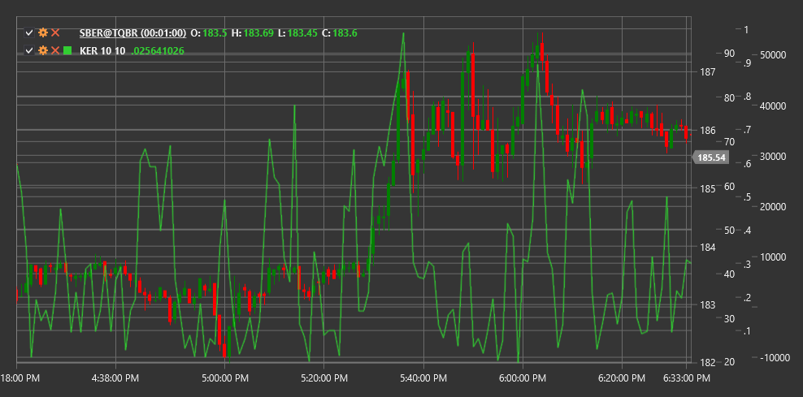

# KER

**ratio de eficiencia de Kaufman (KER)** es un indicador técnico desarrollado por Perry Kaufman que mide la eficiencia del movimiento de precios comparando el movimiento direccional de precios con la volatilidad general.

Para utilizar el indicador, debe utilizar la clase [KaufmanEfficiencyRatio](xref:StockSharp.Algo.Indicators.KaufmanEfficiencyRatio).

## Descripción

El ratio de eficiencia de Kaufman (KER) evalúa qué tan "eficientemente" se mueve el precio en una dirección específica en comparación con el camino total que recorre. Representa la relación entre el movimiento neto direccional de precios y la suma de todos los cambios de precios durante un período específico.

KER fue desarrollado por Perry Kaufman y originalmente se utilizó como componente de la media móvil adaptativa (KAMA). Sin embargo, KER en sí es una herramienta valiosa que ayuda a determinar si el mercado se encuentra en un estado de tendencia u oscilación.

Los valores de KER oscilan entre 0 y 1:
- Los valores cercanos a 1 indican un movimiento de precios altamente eficiente (tendencia fuerte)
- Los valores cercanos a 0 indican un movimiento de precios ineficiente (mercado lateral o alta volatilidad)

## Parámetros

El indicador tiene los siguientes parámetros:
- **Length** - período para el cálculo de eficiencia (valor predeterminado: 10)

## Cálculo

El cálculo de ratio de eficiencia de Kaufman implica los siguientes pasos:

1. Calcule el movimiento direccional (cambio neto) durante el período:
   ```
   Direction = |Price[current] - Price[current - Length]|
   ```

2. Calcule el movimiento total (suma de todos los cambios) durante el período:
   ```
   Volatility = Sum(|Price[i] - Price[i-1]|) para i desde (current - Length + 1) hasta current
   ```

3. Calcular el ratio de eficiencia:
   ```
   KER = Direction / Volatility
   ```

donde:
- Price - precio de cierre habitual
- Length - período de cálculo
- | | - denota valor absoluto

Si la volatilidad es cero (lo cual es poco probable), KER se establece en cero para evitar la división por cero.

## Interpretación

El ratio de eficiencia de Kaufman se puede interpretar de la siguiente manera:

1. **Niveles de eficiencia**:
   - Los valores High KER (>0,6) indican una fuerte tendencia
   - Los valores medios de KER (0,3-0,6) indican una tendencia moderada
   - Los valores Low KER (<0,3) indican un mercado lateral o alta volatilidad

2. **KER Changes**:
   - El crecimiento de KER puede indicar la formación o el fortalecimiento de una tendencia
   - La caída de KER puede indicar un debilitamiento de la tendencia o una transición a un movimiento lateral

3. **Estrategias de trading**:
   - Durante los períodos de alta eficiencia (alto KER), son preferibles las estrategias de tendencia
   - Durante los períodos de baja eficiencia (bajo KER), son preferibles las estrategias de negociación de rango

4. **Filtrado de señal**:
   - KER se puede utilizar para filtrar señales de otros indicadores
   - Las señales del indicador de tendencia son más confiables en KER alto
   - Las señales del oscilador son más confiables a niveles bajos de KER

5. **Adaptación a las condiciones del mercado**:
   - KER permite adaptar las estrategias de trading a las condiciones cambiantes del mercado
   - Los operadores pueden ajustar dinámicamente los parámetros de otros indicadores basados en los valores KER

6. **Change Precursor**:
   - Los cambios bruscos de KER a menudo preceden a nuevos movimientos de precios
   - La caída de KER después de un período de valores altos puede advertir de un posible cambio de tendencia



## Véase también

[KAMA](kama.md)
[ADX](adx.md)
[VHF](vhf.md)
[VIDYA](vidya.md)