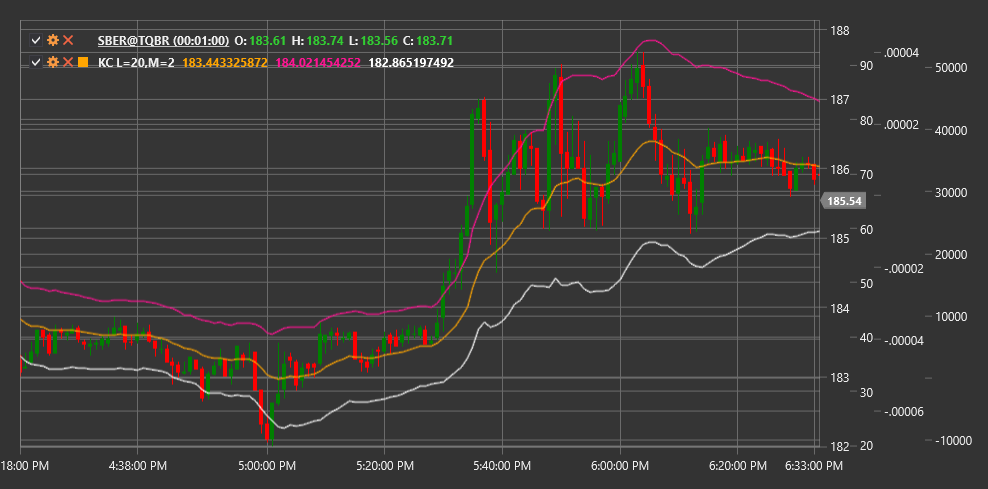

# KC

**Keltner Channels (KC)** es un indicador técnico que consta de un conjunto de bandas de volatilidad que utiliza una media móvil exponencial (EMA) como línea central y el rango verdadero promedio (ATR) para determinar el ancho del canal.

Para utilizar el indicador, debe utilizar la clase [KeltnerChannels](xref:StockSharp.Algo.Indicators.KeltnerChannels).

## Descripción

Los canales Keltner constan de tres líneas:
1. **Línea Central**: normalmente representado por un EMA de 20 períodos
2. **Banda superior**: línea central más un multiplicador de ATR
3. **Banda inferior**: línea central menos el mismo multiplicador ATR

El indicador fue desarrollado por Chester Keltner en la década de 1960 y posteriormente modificado por Linda Raschke, quien reemplazó la media móvil simple (SMA) por una media móvil exponencial (EMA) y comenzó a utilizar ATR en lugar del rango máximo-mínimo para calcular el ancho del canal.

Los canales Keltner ayudan a los operadores a determinar la dirección de la tendencia y los posibles niveles de soporte y resistencia. También se utilizan para identificar condiciones de sobrecompra y sobreventa cuando el precio toca o atraviesa la banda superior o inferior, respectivamente.

## Parámetros

El indicador tiene los siguientes parámetros:
- **Length** - período para calcular EMA y ATR (valor predeterminado: 20)
- **Multiplier** - multiplicador para ATR, que determina el ancho del canal (valor predeterminado: 2,0)

## Cálculo

El cálculo de los canales de Keltner implica los siguientes pasos:

1. Calcular la media móvil exponencial:
   ```
   Línea media = EMA(Precio, Longitud)
   ```

2. Calcular el rango verdadero promedio:
   ```
   ATR = rango verdadero promedio durante el periodo Length
   ```

3. Calcular las bandas superior e inferior:
   ```
   Banda superior = Línea media + (Multiplicador * ATR)
   Banda inferior = Línea media - (Multiplicador * ATR)
   ```

donde:
- Price - precio de cierre habitual
- EMA - media móvil exponencial
- ATR - rango verdadero promedio
- Length - período para el cálculo de EMA y ATR
- Multiplier - multiplicador que determina el ancho del canal

## Interpretación

Los canales de Keltner se pueden interpretar de la siguiente manera:

1. **Dirección de tendencia**:
   - Cuando las tres líneas apuntan hacia arriba, esto indica una tendencia ascendente.
   - Cuando las tres líneas apuntan hacia abajo, esto indica una tendencia a la baja.
   - El movimiento de la línea horizontal indica una tendencia lateral

2. **Rupturas**:
   - El precio al superar la banda superior puede indicar un fuerte impulso alcista
   - El precio al romper por debajo de la banda inferior puede indicar un fuerte impulso a la baja
   - Las rupturas se utilizan a menudo como señales de entrada en la dirección de la ruptura.

3. **Regresa a la Línea Media**:
   - Después de romper la banda superior o inferior, el precio suele regresar a la línea media.
   - La línea media puede servir como nivel de soporte o resistencia.

4. **Condiciones de sobrecompra y sobreventa**:
   - El precio cerca o más allá de la banda superior puede indicar condiciones de sobrecompra
   - El precio cerca o más allá de la banda inferior puede indicar condiciones de sobreventa
   - En los mercados en tendencia, el precio puede permanecer en zonas "extremos" durante períodos prolongados.

5. **Contracción y expansión del canal**:
   - El estrechamiento del canal (disminución de la distancia entre bandas) indica una menor volatilidad, que a menudo precede a un fuerte movimiento de precios.
   - La expansión del canal indica una mayor volatilidad

6. **Estrategias de trading**:
   - Estrategia "Edge to Middle": abrir una posición cuando el precio toca la banda superior o inferior, apuntando a la línea media
   - Estrategia de ruptura: abrir una posición cuando el precio rompe la banda superior o inferior, esperando un movimiento continuo en la misma dirección
   - Estrategia "Middle to Edge": abrir una posición cuando el precio rebota desde la línea media, apuntando a la banda superior o inferior



## Véase también

[BollingerBands](bollinger_bands.md)
[DonchianChannels](donchian_channels.md)
[EMA](ema.md)
[ATR](atr.md)
