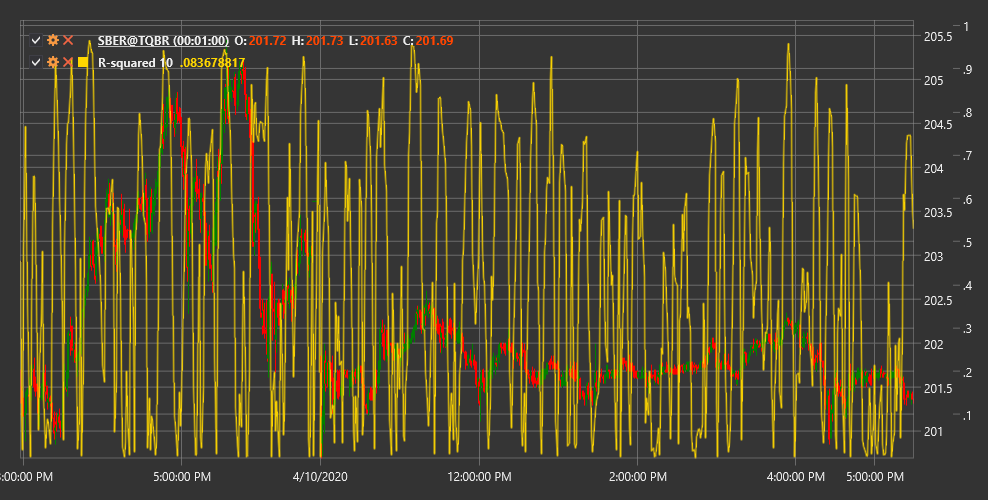

# R cuadrado

**R cuadrado en regresión lineal (R cuadrado de regresión lineal)** es un indicador técnico que mide qué tan bien la regresión lineal se aproxima a los datos de precios y determina la fuerza de la tendencia del mercado.

Para utilizar el indicador, debe utilizar la clase [LinearRegRSquared](xref:StockSharp.Algo.Indicators.LinearRegRSquared).

## Descripción

R-Squared en regresión lineal (R²) es una medida estadística que se utiliza para evaluar el grado de correspondencia entre los datos de precios y una línea de regresión lineal trazada a través de estos datos. En el contexto del análisis técnico, R² muestra en qué medida el movimiento actual del precio corresponde a una tendencia lineal.

Los valores de R² varían de 0 a 1 (o de 0% a 100%):
- Un valor cercano a 1 (100%) indica que los precios se alinean muy bien a lo largo de la línea de tendencia, lo que significa una tendencia fuerte.
- Un valor cercano a 0 indica la ausencia de una tendencia lineal y es característico de mercados laterales, caóticos o cíclicos.

El indicador ayuda a los operadores a distinguir entre períodos de fuertes tendencias y períodos de consolidación o movimientos laterales, permitiéndoles elegir una estrategia comercial adecuada.

## Parámetros

El indicador tiene los siguientes parámetros:
- **Length** - período para el cálculo de regresión lineal (valor predeterminado: 14)

## Cálculo

R-Squared en el cálculo de regresión lineal implica los siguientes pasos:

1. Construcción de una línea de regresión lineal para datos de precios durante el período Length:
   ```
   y = a + b*x
   ```
   donde:
   - y - precio (variable dependiente)
   - x - número de secuencia del período (variable independiente)
   - a - término libre (intercepción del eje y)
   - b - coeficiente de pendiente

2. Calcular la suma de las desviaciones al cuadrado de la regresión (SSE):
   ```
   SSE = Sum((precio real - precio previsto)^2)
   ```
   donde:
   - Precio real - precio real
   - Precio previsto: precio previsto a partir de la ecuación de regresión

3. Calculando la suma total de cuadrados (SST):
   ```
   SST = Sum((precio real - precio promedio)^2)
   ```
   Donde precio medio es el precio medio durante el período Length

4. Calculando R²:
   ```
   R² = 1 - (SSE / SST)
   ```

## Interpretación

R-Squared en regresión lineal se puede interpretar de la siguiente manera:

1. **Evaluación de la fuerza de la tendencia**:
   - Valores superiores a 0,7 (70%) indican una fuerte tendencia
   - Valores entre 0,3 y 0,7 (30-70%) indican una tendencia moderada
   - Los valores inferiores a 0,3 (30%) indican una tendencia débil o ninguna tendencia

2. **Selección de estrategia de trading**:
   - Con valores R² altos (tendencia fuerte), las estrategias de seguimiento de tendencias son efectivas
   - Con valores bajos de R² (movimiento lateral), las estrategias de negociación de rango son efectivas

3. **Búsqueda de puntos de transición**:
   - El aumento de R² puede indicar la formación de una nueva tendencia
   - La disminución del R² puede indicar un debilitamiento de la tendencia y una posible consolidación o reversión

4. **Filtrado de señal**:
   - Las señales de los indicadores de tendencia son más fiables con valores altos de R²
   - Las señales del oscilador son más confiables con valores bajos de R²

5. **Combinando con otros indicadores**:
   - R² se utiliza a menudo para determinar el modo de mercado, después de lo cual se aplican los indicadores apropiados.
   - Por ejemplo, utilice medias móviles con R² alto y oscilador estocástico con R² bajo.

6. **Evaluación de la previsibilidad del mercado**:
   - Los valores High R² indican un movimiento de precios más predecible en el corto plazo
   - Los valores Low R² indican un movimiento más caótico e impredecible

7. **Marcos temporales**:
   - R² puede producir diferentes resultados en diferentes plazos
   - Comparar R² entre períodos de tiempo puede proporcionar información adicional sobre la estructura del mercado



## Véase también

[LinearRegression](lrc.md)
[StandardError](standard_error.md)
[ChoppinessIndex](choppiness_index.md)
