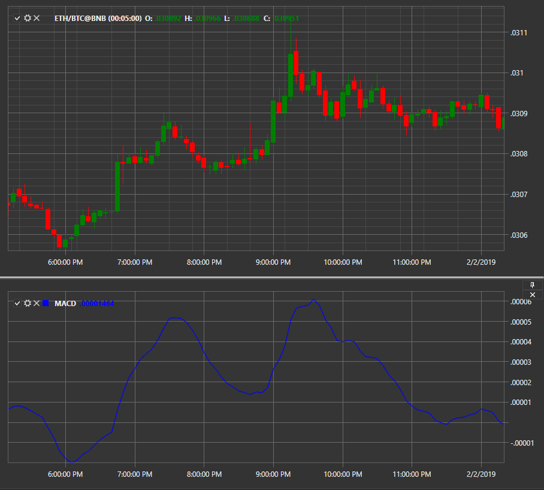

# MACD

**Convergencia/Divergencia de Medias Móviles (MACD)** es un indicador de impulso que muestra la relación entre dos promedios móviles del precio de un valor.

El indicador se calcula como la diferencia entre una media móvil corta y una media móvil larga. De forma predeterminada, los períodos para estos promedios se establecen en 12 y 26, respectivamente.

Para utilizar el indicador, se debe utilizar la clase [MovingAverageConvergenceDivergence](xref:StockSharp.Algo.Indicators.MovingAverageConvergenceDivergence).

## Véase también

[Histograma MACD](macd_histogram.md)
