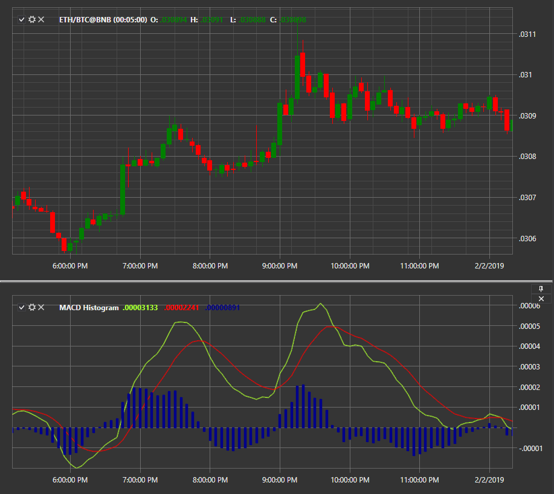

# Histograma MACD

**Convergencia/Divergencia de Medias Móviles (MACD)** es un indicador de impulso que muestra la relación entre dos promedios móviles del precio de un valor, presentado como un histograma.

Para utilizar el indicador, se debe utilizar la clase [MovingAverageConvergenceDivergenceHistogram](xref:StockSharp.Algo.Indicators.MovingAverageConvergenceDivergenceHistogram).

Para calcular el indicador se utilizan tres medias móviles exponenciales con diferentes períodos. La media móvil rápida con un período más corto (EMA_s) se resta de la media móvil lenta con un período más largo (EMA_l). La línea MACD se construye a partir de los valores obtenidos.

MACD = EMA_s(P) − EMA_l(P)

Los períodos predeterminados son 12 y 26. Luego, esta línea se suaviza mediante una tercera media móvil exponencial (EMA_a), generalmente con un período de 9, lo que da como resultado la llamada línea de señal MACD (Signal).

Signal = EMA_a(EMA_s(P) − EMA_l(P))

Estas dos curvas resultantes representan el MACD lineal regular. Además, la línea cero, con respecto a la cual fluctúan las curvas, suele estar marcada en la ventana del indicador.

Al construir el histograma MACD, las barras del histograma muestran la diferencia entre la línea de señal y la línea MACD, simplificando aún más la percepción del indicador.

## Véase también

[MACD con línea de señal](macd_with_signal_line.md)
