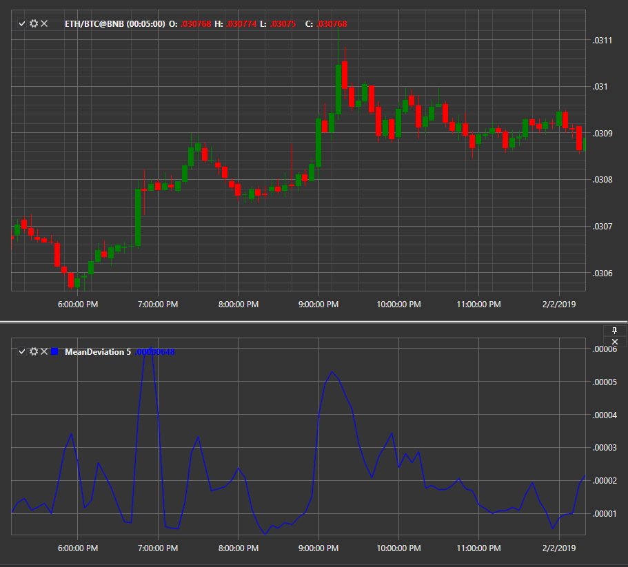

# Mean Deviation

El indicador **Mean Deviation** muestra la desviación promedio del precio de su promedio móvil simple (SMA) durante un período determinado.

Para utilizar el indicador, se debe utilizar la clase [MeanDeviation](xref:StockSharp.Algo.Indicators.MeanDeviation).

## Véase también

[Precio mediano](median_price.md)
