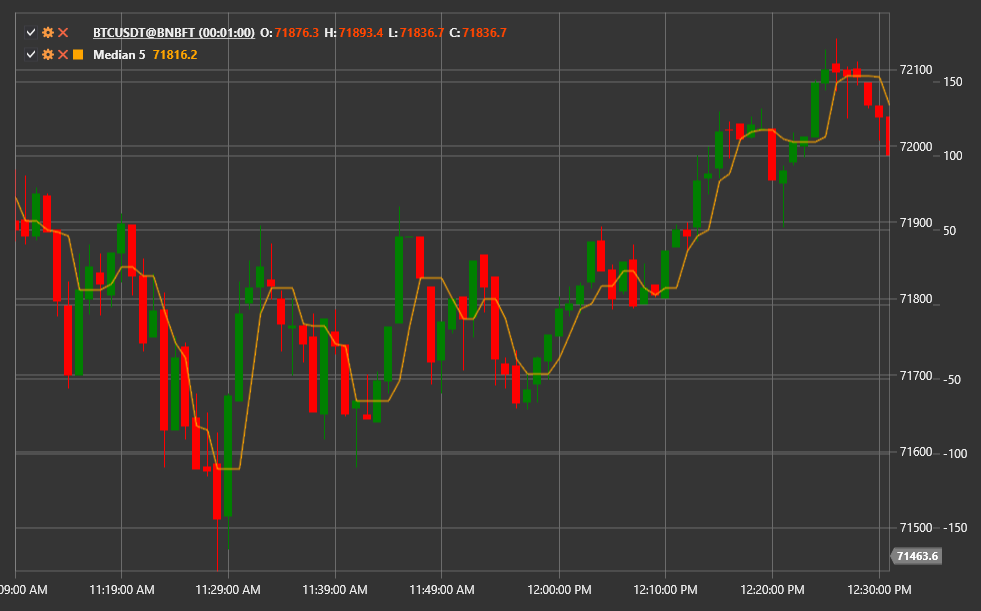

# Mediana móvil

El indicador **Mediana móvil** calcula la mediana de los N valores más recientes. En comparación con las medias móviles, es menos
sensible a valores atípicos y preserva cambios abruptos de precios, lo que lo hace útil en entornos ruidosos.

Utilice la clase [Median](xref:StockSharp.Algo.Indicators.Median) para acceder al indicador.

## Descripción

Un filtro mediano ordena los precios dentro de la ventana móvil y selecciona el valor medio. Como resultado:

- Los picos o caídas individuales no distorsionan la salida.
- El retraso es menor que con muchos filtros de suavizado.
- La forma de la señal sigue siendo más angular, lo que ayuda a capturar las inversiones.

## Parámetros

- **Length**: tamaño de ventana utilizado para calcular la mediana. Las ventanas más grandes ofrecen un suavizado más fuerte pero aumentan el retraso.

## Uso

- Aplique el Mediana móvil como alternativa a las medias móviles cuando los datos de precios contengan ruido significativo.
- Los cruces entre el precio y la mediana pueden tratarse como señales de cambio de tendencia.
- Combine la mediana con otros filtros para extraer tendencias manteniendo importantes saltos de precios.

## Véase también

[SMA](sma.md)
[EMA](ema.md)
[Media móvil suavizada](smoothed_ma.md)
